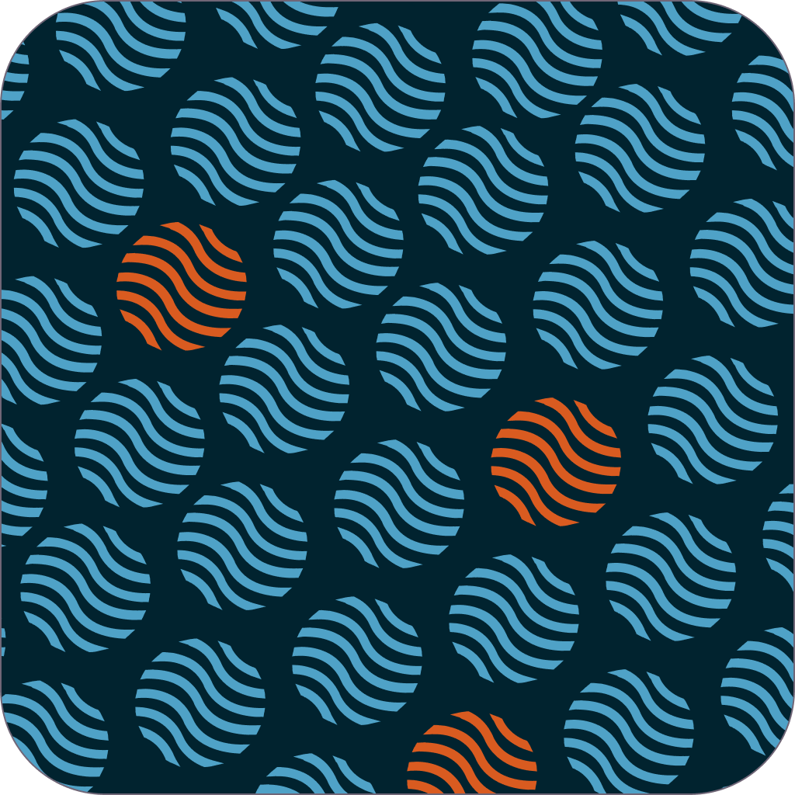
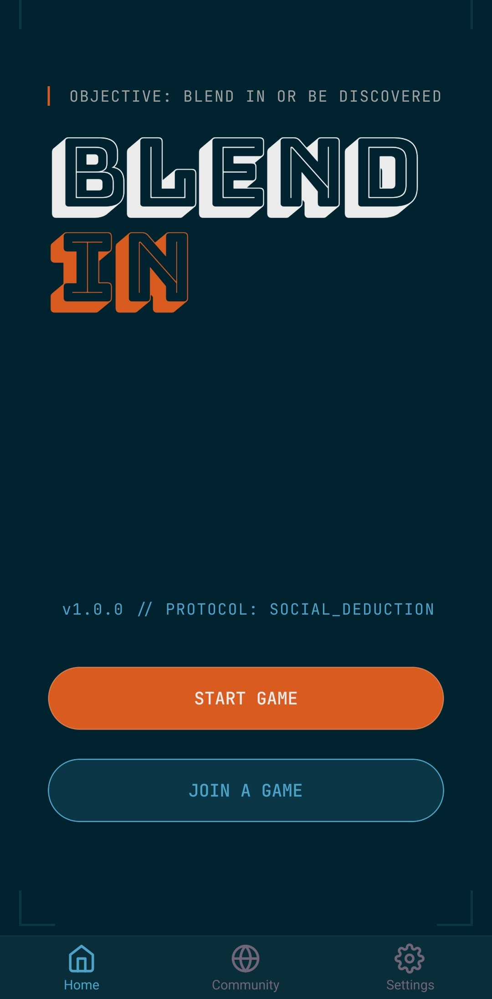
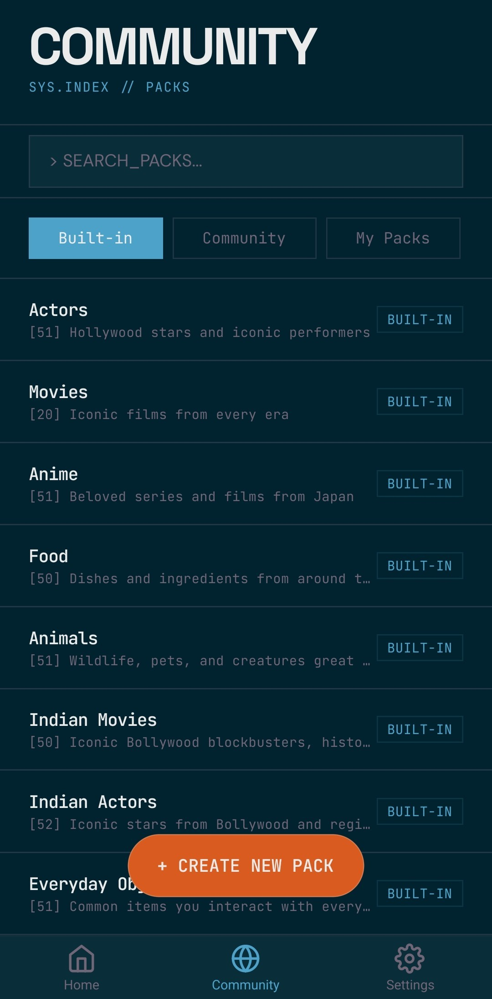
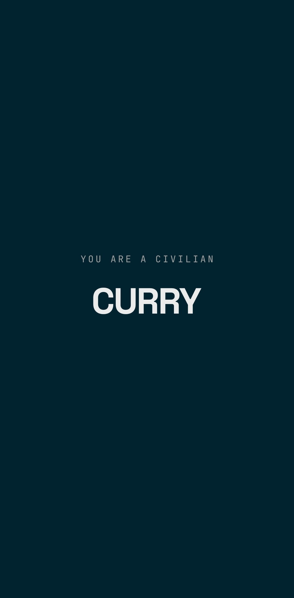

# BlendIn

---

    
    &nbsp;&nbsp;
    

 

  
  
  
  

---

### App Preview

  
  &nbsp;&nbsp;
  
  &nbsp;&nbsp;
  

 

---

### Master the art of deception. Seamlessly.

*BlendIn is a high-tension, real-time social deduction party game. Built with a sleek, brutalist hacker aesthetic, it empowers players to jump into games instantly without physical props or complicated setup. Generate custom word packs using AI, host 12-player lobbies instantly, and uncover the imposter.*

 

<table>
<tr>
<td width="25%" valign="top">

**Instant Lobbies**
`Ultra-Fast`

Create or join a real-time room in seconds with a 6-digit code.

</td>
<td width="25%" valign="top">

**AI Pack Generator**
`Built-In`

Automatically parse AI-generated custom words, decoys, and hints.

</td>
<td width="25%" valign="top">

**Community Hub**
`Shared Content`

Publish, browse, and upvote community-created word packs.

</td>
<td width="25%" valign="top">

**OTA Updates**
`Zero Friction`

App updates are delivered and applied instantly on cold boot.

</td>
</tr>
</table>

> **What makes BlendIn different**
> - Premium, 1px-grid brutalist user interface
> - High-tension social deduction gameplay out of the box
> - AI-powered custom word pack builder built directly into the UI
> - End-to-end real-time synchronization powered by Supabase
> - Flawlessly responsive Over-The-Air (OTA) update delivery

 

---

### What it does

<table width="100%">
  <tr>
    <td width="50%" valign="top" style="padding: 16px; border: 1px solid #4da2ca; border-radius: 4px; background-color: #00232f; color: #ebebeb;">
      <h3 style="color: #D95B1F;">Real-Time Multiplayer</h3>
      Join a room and watch players pop in instantly. Supabase Realtime keeps the lobby, game state, and countdown timers perfectly synced across all devices.
    </td>
    <td width="4%"></td>
    <td width="50%" valign="top" style="padding: 16px; border: 1px solid #4da2ca; border-radius: 4px; background-color: #00232f; color: #ebebeb;">
      <h3 style="color: #D95B1F;">Custom Word Packs</h3>
      Don't want to use the default categories? Use the built-in AI prompt helper to generate brilliant, balanced word packs and paste them in.
    </td>
  </tr>
  <tr><td colspan="3" height="10"></td></tr>
  <tr>
    <td width="50%" valign="top" style="padding: 16px; border: 1px solid #4da2ca; border-radius: 4px; background-color: #00232f; color: #ebebeb;">
      <h3 style="color: #D95B1F;">Role Engine</h3>
      The game engine automatically handles role distribution, ensuring fair play and assigning highly specific decoys that perfectly match the primary word.
    </td>
    <td width="4%"></td>
    <td width="50%" valign="top" style="padding: 16px; border: 1px solid #4da2ca; border-radius: 4px; background-color: #00232f; color: #ebebeb;">
      <h3 style="color: #D95B1F;">Community Library</h3>
      Publish your custom packs to the global community database. Upvote the best packs and instantly load them into your next lobby.
    </td>
  </tr>
</table>

 

---

### Get started in 60 seconds

> **Try the game instantly:** Download the official Android APK directly from the **[Latest GitHub Release](https://github.com/Prathmesh-D/BlendIn/releases/latest)**!

Or, if you prefer to run it locally for development, follow these steps:

<table width="100%" cellspacing="0" cellpadding="0">
  <tr>
    <td width="36" valign="top" align="center">
      <strong>1</strong>
    </td>
    <td valign="top" style="padding-left: 12px;">
      <strong>Clone the Repository</strong>  
      Pull down the code directly from GitHub into your local environment: <code>git clone https://github.com/Prathmesh-D/BlendIn.git</code>  
    </td>
  </tr>
  <tr><td colspan="2" height="20"></td></tr>
  <tr>
    <td width="36" valign="top" align="center">
      <strong>2</strong>
    </td>
    <td valign="top" style="padding-left: 12px;">
      <strong>Configure Supabase</strong>  
      Create a <code>.env.local</code> file in the root directory. Add your <code>EXPO_PUBLIC_SUPABASE_URL</code> and <code>EXPO_PUBLIC_SUPABASE_ANON_KEY</code>. Run the migration scripts in the <code>supabase/migrations/</code> folder to initialize your database schema and RLS policies.  
    </td>
  </tr>
  <tr><td colspan="2" height="20"></td></tr>
  <tr>
    <td width="36" valign="top" align="center">
      <strong>3</strong>
    </td>
    <td valign="top" style="padding-left: 12px;">
      <strong>Start the App</strong>  
      Install dependencies using <code>npm install</code>. Start the Expo development server using <code>npx expo start -c</code>. Scan the QR code with Expo Go on your phone or hit <code>a</code> to open an Android emulator. You're ready to start deceiving your friends!  
    </td>
  </tr>
</table>

 

---

Built by **[Prathmesh Deshkar](https://github.com/Prathmesh-D)**

*If it was useful or interesting, a star is always appreciated.*

---

