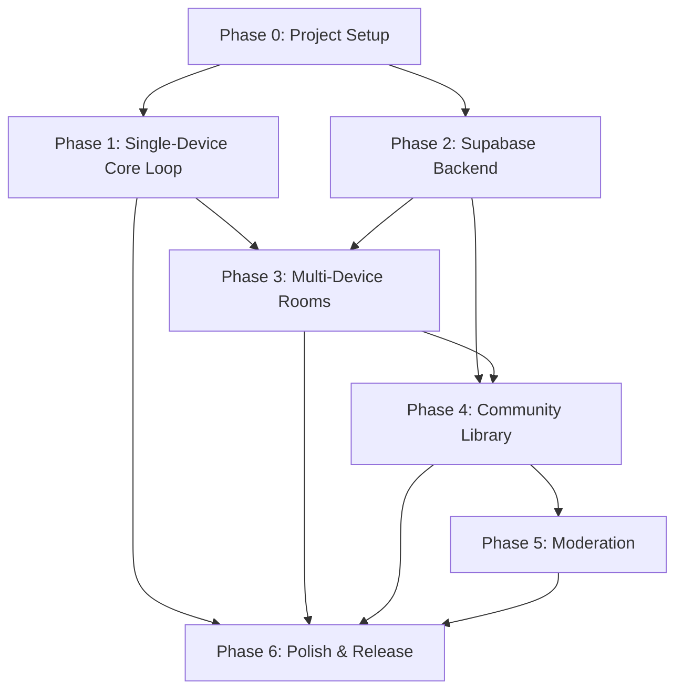

# BlendIn — Phased Implementation Plan (v2)

## Goal

Build the BlendIn social-deduction party game from scratch as a React Native + Expo app backed by Supabase, following the specifications in the [PRD](file:///e:/VSCodeCodes/BlendIn/BlendIn_PRD.md), [TRD](file:///e:/VSCodeCodes/BlendIn/BlendIn_TRD.md), [AppFlow](file:///e:/VSCodeCodes/BlendIn/BlendIn_AppFlow.md), and [BackendSchema](file:///e:/VSCodeCodes/BlendIn/BlendIn_BackendSchema.md). This plan sequences work so that no task is scheduled before its dependencies exist, flags technical risks, and calls out underspecified areas needing decisions.

---

## Key Design Decisions (Resolved)

The following decisions were left open in the source documents and are now locked for implementation:

### 1. Color Palette

| Role | Name | Hex | Usage |
|---|---|---|---|
| Base | Jet Black | `#00232f` | Backgrounds, primary surfaces |
| Secondary | Steel Blue | `#4da2ca` | Interactive elements, headers, info states |
| Accent / Imposter | Burnt Orange | `#D95B1F` | Imposter indicators, CTAs, alerts, "odd one out" theming |
| Neutral | Dim Grey | `#706677` | Secondary text, borders, muted UI |
| Light | Platinum | `#ebebeb` | Light backgrounds, cards, text on dark surfaces |

> [!NOTE]
> Accent adjusted from the original Red Ochre (#c83717, hue 11°) to **Burnt Orange (#D95B1F, hue ~21°)**. Rationale: the PRD specifies "orange" as the imposter accent color; shifting warmer improves the "party game energy" feel and provides stronger semantic contrast against the cool blues/navy. The original was solid red — this nudge lands it firmly in burnt-orange territory while preserving the bold, high-contrast character.

### 2. Classic Pair Difficulty — Tunable via Three Decoy Columns

The `words` table gets **three decoy columns** instead of one:

```sql
decoy_easy    text  -- closely related word (e.g., "Sushi" → "Ramen")
decoy_medium  text  -- somewhat related word (e.g., "Sushi" → "Dumpling")  
decoy_hard    text  -- loosely related word (e.g., "Sushi" → "Croissant")
```

- Host selects difficulty tier (Easy / Medium / Hard) during Game Setup alongside the Classic Pair variant.
- Role assignment engine reads the corresponding column.
- Content authoring must populate all three tiers per word entry in built-in packs.
- Custom packs: all three tiers optional — if a tier is empty, the app falls back to the next-available tier or disables that difficulty option for the pack.

### 3. Rating Scale — 1–5 Stars

- `pack_ratings.score` is `smallint CHECK (score BETWEEN 1 AND 5)`.
- `word_packs.rating_avg` is computed as a standard arithmetic mean.
- UI: 5-star selector on the Pack Detail screen, shown only after rating eligibility is met (user has a `pack_plays` row).

### 4. Mirror Round (All-Imposter) — Resolution Mechanic

Designed to match the PRD's stated goal ("identifying who shares the closest word to your own, or guessing what others were given") while staying true to the app's philosophy of verbal, player-paced gameplay:

**Flow:**
1. **Hint Phase** — Same as normal rounds. Each player gives one verbal hint about their word. Since every player has a *different but related* word from the same `mirror_group`, hints will naturally overlap and create confusion.
2. **Discussion** — Players discuss verbally, trying to deduce what specific words others were given. No in-app voting or pairing mechanic — keeps it consistent with the rest of the game.
3. **Reveal All Words** — Host taps a **"Reveal All Words"** button (replaces "Reveal Imposter"). The app displays every player's name alongside their actual word, all shown simultaneously.
4. **Outcome** — Two buttons, relabeled for the Mirror Round context:
   - **"Cracked It!"** — The group agrees they successfully figured out most players' words during discussion.
   - **"Total Bluff!"** — Players' hints were misleading enough that the group couldn't determine each other's words.

**Scoring:**
- **"Cracked It!"** → **+2 to every player**. Rewards active deduction and engaged play.
- **"Total Bluff!"** → **+1 to every player**. Consolation — everyone blended in, but the round was less collaborative.

**Design rationale:** Making "Cracked It!" worth *more* incentivizes players to give hints that are genuinely informative (creating lively discussion), rather than stonewalling with maximally vague hints. The tension becomes: *"I want to give a hint clear enough that we can all earn +2, but vague enough that it's not immediately obvious which specific related word I have."* Both outcomes award points since there are no "civilians" to protect — the round is inherently collaborative.

### 5. `room_players` Split → Two Tables

Split the original `room_players` table into:

**`room_players`** (public lobby data — visible to all room participants):

| Column | Type | Notes |
|---|---|---|
| id | uuid, PK | |
| room_id | uuid, FK → rooms.id | |
| user_id | uuid, FK → profiles.user_id, nullable | |
| display_name | text | |
| joined_at | timestamptz | |

**`room_player_roles`** (sensitive per-round data — visible ONLY to the owning player):

| Column | Type | Notes |
|---|---|---|
| id | uuid, PK | |
| room_player_id | uuid, FK → room_players.id | |
| round_id | uuid, FK → rounds.id | |
| is_imposter | boolean | |
| assigned_word | text, nullable | |
| assigned_hint | text, nullable | |
| assigned_category_only | boolean, default false | |

**RLS policies become trivially simple:**
- `room_players`: SELECT for any authenticated user who is a participant of the same room (`WHERE room_id IN (SELECT room_id FROM room_players WHERE user_id = auth.uid())`). This safely powers the live lobby player list.
- `room_player_roles`: SELECT restricted to `WHERE room_player_id IN (SELECT id FROM room_players WHERE user_id = auth.uid())`. No other player can ever read another's role row, period.

**Bonus:** This split also models the data more accurately — role assignments are per-round (they change every round), while player membership is per-room (stable across rounds). The `current_round_id` column from the original schema is eliminated; the join on `round_id` in `room_player_roles` handles the same need.

---

## UI/UX Design Identity

BlendIn's interface is a party game that looks and feels like one. The visual identity is **bold, funky, modern, and youthful** without being childish or chaotic. The goal is **controlled visual experimentation**: every typographic choice, color application, spacing decision, and motion curve is deliberate and contributes to a cohesive identity.

### Design Dials (adapted from Taste Skill for mobile context)

| Dial | Value | Rationale |
|---|---|---|
| DESIGN_VARIANCE | 8 | Asymmetric layouts, unexpected visual rhythm, varied spacing. Not symmetrical or corporate. |
| MOTION_INTENSITY | 7 | Party game energy: spring physics, reveal drama, score celebrations. Mobile-appropriate, not cinematic web scroll-hijacks. |
| VISUAL_DENSITY | 4 | Game screens need breathing room. Readable at arm's length, in low light, amid distraction. Spacious, not packed. |

### Typography System

Typography contrast is a core part of BlendIn's identity. The pairing is **expressive display + precise technical + readable body**.

| Role | Typeface | Usage | Character |
|---|---|---|---|
| **Display** | **Space Grotesk** (700/Bold) | Screen titles, hero statements, player names during reveals, score numbers, round announcements, pack titles, section headings | Geometric confidence with personality. Squared terminals and slightly unusual proportions give it funk without chaos. |
| **Technical / UI** | **JetBrains Mono** (400, 500) | Join codes, room codes, button labels, nav labels, metadata, stat values, category tags, difficulty tier labels, score deltas (`+2`), status text, timestamps | Precise, systematic, confident. Monospace creates a "game system" feel. Join codes read like access codes. Scores read like ticker output. |
| **Body / Reading** | **DM Sans** (400, 500) | Onboarding copy, pack descriptions, rule explanations, form helper text, longer prose, settings content | Clean geometric sans. Warmer than Inter, more personality, neutral enough to not compete with Space Grotesk. |

**Why this pairing works:** Space Grotesk has a geometric soul with idiosyncratic details (angled terminals, the distinctive 'g', a squared feel). JetBrains Mono as the technical counterpoint creates a "game system meets underground club flyer" tension. DM Sans bridges them for reading contexts. The contrast between display and monospace becomes the application's typographic signature.

**Sizing scale (base mobile):**

```
Display XL:  32px / Space Grotesk Bold    — hero statements, round announcements
Display L:   24px / Space Grotesk Bold    — screen titles, score numbers
Display M:   20px / Space Grotesk Bold    — section headings, player names
Label L:     16px / JetBrains Mono Medium — join codes, primary buttons
Label M:     14px / JetBrains Mono Regular — metadata, tags, secondary buttons
Label S:     12px / JetBrains Mono Regular — timestamps, tertiary labels
Body L:      16px / DM Sans Regular       — primary body copy
Body M:      14px / DM Sans Regular       — secondary copy, descriptions
Body S:      12px / DM Sans Regular       — captions, helper text
```

> [!NOTE]
> All font sizes are mobile base values. Use `PixelRatio.getFontScale()` for accessibility scaling. Line heights: display types at 1.1-1.2, body at 1.5, labels at 1.3.

### Enhanced Color System

The resolved palette from Key Design Decisions §1 is expanded into a full token system:

| Token | Value | Usage |
|---|---|---|
| `base` | `#00232f` | Primary background. Deep teal-black (not dead black). |
| `base.elevated` | `#0a2d3a` | Elevated surfaces, cards, modals. Slight lift from base. |
| `base.subtle` | `#133845` | Tertiary surfaces, input backgrounds. |
| `secondary` | `#4da2ca` | Interactive elements, links, info states, headers. |
| `secondary.muted` | `rgba(77, 162, 202, 0.15)` | Secondary tinted backgrounds, hover fills. |
| `accent` | `#D95B1F` | Imposter indicators, primary CTAs, alerts, score highlights. The "funk" color. |
| `accent.muted` | `rgba(217, 91, 31, 0.15)` | Accent tinted backgrounds, imposter-themed surfaces. |
| `accent.bright` | `#E8702F` | Animated score glow, celebration state, emphasis. |
| `neutral` | `#706677` | Secondary text, borders, muted UI, inactive states. |
| `neutral.border` | `rgba(112, 102, 119, 0.3)` | Subtle structural borders. |
| `light` | `#ebebeb` | Primary text on dark, card content. |
| `light.muted` | `#a0a0a0` | Secondary text, placeholder text. |
| `success` | `#2ECC71` | "Busted!" outcome, civilian win, positive states. |
| `error` | `#E74C3C` | Error states, destructive actions. |

**Theme lock:** Dark-first. The `base` Jet Black is the canvas. All surfaces layer upward through lightness, not downward through shadow. No light-mode variant for v1.

### Shape Language

BlendIn's shape system uses **deliberate contrast** between two shape families:

| Shape | Radius | Usage |
|---|---|---|
| **Sharp** | `0px` | Large containers, screen sections, card groups, image frames, header areas. Sharp edges = structure, grounding. |
| **Pill** | `999px` / full radius | Buttons, chips, tags, status badges, toggle tracks, input fields. Pill = interactive, touchable, alive. |
| **Functional** | `8px` | Toast notifications, dropdown menus, modal corners. Mid-radius only for functional UI chrome. |

**The contrast between sharp containers and pill-shaped interactive elements is the shape identity.** No generic 12px-on-everything softness.

### Motion Principles

Motion in BlendIn serves the game's emotional arc: anticipation (role reveal), tension (hint round), release (outcome), celebration (score update).

| Context | Motion Type | Implementation |
|---|---|---|
| Screen transitions | Directional stack push/pop | `react-native-reanimated` shared transitions, 300ms spring |
| Role reveal | Dramatic, cinematic | Scale 0.8 -> 1.0 + opacity, spring with low damping. Paired with haptic impact. |
| Score updates | Punchy celebration | Number counter animation + scale bounce + optional confetti burst |
| Outcome reveal | Impactful moment | Full-screen color wash (Burnt Orange for imposter, Success green for civilians) + type scale-in |
| Button press | Tactile feedback | `scale(0.96)` on press + haptic light impact |
| List item enter | Staggered reveal | Opacity + translateY(12), stagger 50ms per item |
| Loading states | Skeleton shimmer | Animated gradient sweep on placeholder shapes matching final layout |
| Error states | Attention shake | Horizontal oscillation, 3 cycles, 200ms total |

**Spring config defaults:**
```typescript
export const springs = {
  snappy:  { damping: 20, stiffness: 300 },    // buttons, toggles
  smooth:  { damping: 25, stiffness: 200 },    // screen transitions
  bouncy:  { damping: 12, stiffness: 180 },    // celebrations, reveals
  gentle:  { damping: 30, stiffness: 150 },    // subtle motion, list items
};
```

> [!IMPORTANT]
> All motion must honor the OS-level reduced-motion accessibility setting (`AccessibilityInfo.isReduceMotionEnabled()` on iOS, `Settings.Global.ANIMATOR_DURATION_SCALE` on Android). When enabled: disable spring physics, collapse to instant or 150ms linear transitions, remove decorative animation entirely. Haptic feedback remains.

### Spacing System

```typescript
export const spacing = {
  xs:  4,    // tight internal padding, icon gaps
  sm:  8,    // compact spacing, tag padding
  md:  16,   // standard component spacing, list gaps
  lg:  24,   // section padding, card internal padding
  xl:  32,   // screen-level padding, major section gaps
  xxl: 48,   // hero-level breathing room, major separations
} as const;
```

Screen-level horizontal padding: `spacing.lg` (24px). Vertical rhythm between sections: `spacing.xl` (32px) minimum. Game screens during active play: more generous spacing for readability at arm's length.

### Visual Rhythm Principles

1. **Hierarchy through type, not decoration.** Space Grotesk at Display XL immediately signals importance. Don't add borders, backgrounds, or icons to create hierarchy that the type system already provides.
2. **Burnt Orange is earned.** The accent color is reserved for high-impact moments: imposter identity, primary CTAs, live game states, score highlights. It should never become wallpaper. If everything is orange, nothing is.
3. **Monospace signals system.** Anything the "game engine" produces (codes, scores, stats, tags, status) gets JetBrains Mono. Anything a human reads (descriptions, instructions, onboarding) gets DM Sans. The typeface tells you who's talking.
4. **Dark surfaces layer, not shadow.** Elevation is achieved by stepping `base` -> `base.elevated` -> `base.subtle`. No drop shadows on dark backgrounds (they disappear). Use 1px `neutral.border` borders for edge definition when needed.
5. **Interactive elements are pills. Structural elements are sharp.** A user can scan the screen and immediately identify what's touchable by shape alone.

---

## Dependency Map



Key dependency reasons:
- **Phase 1 before Phase 3**: The core game-state machine (setup → role assignment → hint round → discussion → resolution → scoring → round summary) must exist locally before layering network sync on top.
- **Phase 2 before Phase 3**: `rooms`, `room_players`, `room_player_roles`, `rounds`, `round_results` tables + RLS + the `create_room` / `join_room` / `start_round` / `resolve_round` Edge Functions must be deployed before any multi-device flow can work.
- **Phase 2 before Phase 4**: `word_packs`, `words`, `categories`, `pack_plays`, `pack_ratings`, `pack_favorites` tables + RLS must exist before Community Library reads/writes.
- **Phase 4 before Phase 5**: Moderation operates on published packs — `pack_reports`, `moderation_actions`, the `report_pack` Edge Function, and the `submit_pack` pre-filter all depend on the pack publishing flow from Phase 4.

---

## Phase 0 — Project Setup & Tooling

**Goal**: Bootable Expo app with navigation skeleton, state management, local storage, dev Supabase project, and CI basics.

### Tasks

- [ ] **P0.1 — Initialize Expo project**
  - `npx create-expo-app@latest ./` with the managed workflow.
  - Confirm minimum supported iOS/Android versions against current Expo SDK baseline ([TRD §2](file:///e:/VSCodeCodes/BlendIn/BlendIn_TRD.md#L9)).
  - Set up TypeScript (strongly recommended — catches role-assignment type bugs early).

- [ ] **P0.2 — Install core dependencies**
  - `react-navigation` (stack + bottom-tab navigators).
  - `zustand` for global state ([TRD §3.1](file:///e:/VSCodeCodes/BlendIn/BlendIn_TRD.md#L18)).
  - `expo-secure-store` and/or `@react-native-async-storage/async-storage` for local persistence ([TRD §3.1](file:///e:/VSCodeCodes/BlendIn/BlendIn_TRD.md#L22)).
  - `@supabase/supabase-js` (client SDK).
  - `expo-camera` (for QR scanning, used in Phase 3).
  - `react-native-qrcode-svg` (for QR rendering, used in Phase 3).

- [ ] **P0.3 — Design system foundation**
  - Create the core design token files implementing the Design Identity (see UI/UX Design Identity section above):
    - **`theme/colors.ts`**: Full color token system including `base`, `base.elevated`, `base.subtle`, `secondary`, `secondary.muted`, `accent`, `accent.muted`, `accent.bright`, `neutral`, `neutral.border`, `light`, `light.muted`, `success`, `error`. Export as a flat object with dot-notation keys.
    - **`theme/typography.ts`**: Font family constants (`SpaceGrotesk-Bold`, `JetBrainsMono-Regular`, `JetBrainsMono-Medium`, `DMSans-Regular`, `DMSans-Medium`), the full sizing scale (Display XL through Body S), and pre-composed text style objects (e.g., `textStyles.displayXL`, `textStyles.labelM`, `textStyles.bodyL`) with font family, size, weight, line height, and letter spacing.
    - **`theme/spacing.ts`**: Spacing constants (`xs` through `xxl`) and screen-level layout values.
    - **`theme/shapes.ts`**: Border radius constants (`sharp: 0`, `pill: 999`, `functional: 8`) and border width/color presets.
    - **`theme/motion.ts`**: Spring config presets (`snappy`, `smooth`, `bouncy`, `gentle`), duration constants, and a `useReducedMotion()` hook wrapping `AccessibilityInfo`.
    - **`theme/index.ts`**: Re-exports everything as a unified `theme` object.
  - Install and configure fonts via `expo-font`:
    - **Space Grotesk** (700 weight) from Google Fonts / bundled assets.
    - **JetBrains Mono** (400, 500 weights) from Google Fonts / bundled assets.
    - **DM Sans** (400, 500 weights) from Google Fonts / bundled assets.
    - Font loading screen (splash screen holds until fonts resolve).
  - **Verify font rendering** on both iOS and Android: confirm Space Grotesk's distinctive character shapes (the 'g', angled terminals) render correctly, JetBrains Mono is properly monospaced, DM Sans metrics are consistent.

- [ ] **P0.3a — Base component primitives**
  - Build foundational UI primitives that enforce the design system. These are the atoms that every screen composites from:
    - **`Text` wrapper component**: Accepts a `variant` prop mapping to `textStyles` (e.g., `<Text variant="displayXL">`, `<Text variant="labelM">`, `<Text variant="bodyL">`). Enforces the typography system at the component level so raw `<Text>` with ad-hoc styles is never needed.
    - **`Button` component**: Pill-shaped by default. Variants: `primary` (Burnt Orange fill, light text), `secondary` (Steel Blue outline), `ghost` (transparent, light text). Press state: `scale(0.96)` spring + haptic light. Disabled state: reduced opacity, no haptic. Loading state: inline spinner replacing label text. All button text in JetBrains Mono Medium.
    - **`Surface` component**: Accepts `elevation` prop (`base`, `elevated`, `subtle`) mapping to background colors. Handles structural container rendering with sharp corners by default.
    - **`Chip` / `Tag` component**: Pill-shaped, compact. For category labels, difficulty tiers, status indicators. JetBrains Mono Label S. Variants: `default` (neutral border), `accent` (Burnt Orange tint), `info` (Steel Blue tint).
    - **`Divider` component**: Horizontal rule using `neutral.border` color. Variants: `full` (edge-to-edge), `inset` (with horizontal padding).
  - These primitives are intentionally minimal. They enforce tokens, not layout. Screen-specific composition happens in Phase 1+.

- [ ] **P0.4 — Navigation skeleton**
  - Create placeholder screens for every screen identified in [AppFlow](file:///e:/VSCodeCodes/BlendIn/BlendIn_AppFlow.md):
    - `LaunchScreen` (§1), `OnboardingScreen` (§1), `HomeScreen` (§2)
    - `GameSetupScreen` (§3), `RoomJoinScreen` (§4), `RoomLobbyScreen` (§4)
    - `RoleRevealScreen` (§6), `HintRoundScreen` (§7), `DiscussionScreen` (§8)
    - `RoundSummaryScreen` (§10)
    - `CommunityLibraryScreen` (§11), `PackDetailScreen` (§11)
    - `CustomPackCreateScreen` (§12)
    - `ProfileScreen` (§13), `SettingsScreen` (§14)
  - Wire up a basic stack navigator connecting them.

- [ ] **P0.5 — Zustand store scaffolding**
  - Create initial store slices:
    - `gameStore`: game phase enum, players list, role assignments, current round settings, scoreboard.
    - `sessionStore`: session-level data (rounds played, imposter history for fair rotation).
    - `authStore`: anonymous device identity, optional authenticated user.

- [ ] **P0.6 — Create Supabase dev project**
  - Create a new Supabase project (dev/staging instance — separate from production per [TRD §10](file:///e:/VSCodeCodes/BlendIn/BlendIn_TRD.md#L105)).
  - Store the Supabase URL and anon key in environment-specific config (`app.config.js` extras or `.env` files), never hardcoded ([TRD §10](file:///e:/VSCodeCodes/BlendIn/BlendIn_TRD.md#L107)).
  - Initialize `supabase-js` client in a shared `lib/supabase.ts` module.

- [ ] **P0.7 — EAS Build profiles**
  - Configure `eas.json` with `development`, `preview`, and `production` profiles ([TRD §10](file:///e:/VSCodeCodes/BlendIn/BlendIn_TRD.md#L106)).
  - Verify a dev build installs and runs on at least one physical device.

- [ ] **P0.8 — Linting, formatting, and testing setup**
  - ESLint + Prettier.
  - Jest (or Vitest) configured for unit tests — critical for Phase 1's role-assignment logic.

---

## Phase 1 — Core Single-Device Pass-and-Play Loop

**Goal**: A fully playable, offline, single-device game loop: setup → role assignment → role reveal (press-and-hold) → hint round → discussion → reveal → outcome logging → scoreboard → next round. No network required.

> [!IMPORTANT]
> This is the highest-value milestone. A working pass-and-play loop is the foundation for everything else. Every subsequent phase layers on top of this game-state machine.

### Prerequisites
- Phase 0 complete.

### UI/UX Focus for Phase 1

Phase 1 is where the design system meets real screens for the first time. Every screen built here must use the primitives from P0.3a, the tokens from P0.3, and must establish the visual hierarchy and interaction patterns that all future screens follow. This phase produces the first real visual impression of BlendIn. If these screens look generic or templated, the entire visual identity fails. Build them with the same care as a hero section.

### Tasks

- [ ] **P1.1 — Built-in word pack data**
  - Create a local JSON data file (bundled with the app per [TRD §9](file:///e:/VSCodeCodes/BlendIn/BlendIn_TRD.md#L100)) containing the launch category packs: **Actors, Movies, Anime, Food, Animals, Everyday Objects** ([PRD §7.6](file:///e:/VSCodeCodes/BlendIn/BlendIn_PRD.md#L77)).
  - Structure each word entry with the **three-decoy-column model**:
    ```json
    {
      "primary_word": "Sushi",
      "decoy_easy": "Ramen",
      "decoy_medium": "Dumpling",
      "decoy_hard": "Croissant",
      "hint_text": "A Japanese dish often served with rice",
      "mirror_group_id": "food-japanese-01"
    }
    ```
  - **Minimum 20–30 word entries per pack**, each with all three decoy tiers and a hint populated.
  - Mirror groups: group 4–8 related words under the same `mirror_group_id` for Mirror Round support.
  - **Content authoring is significant work** — start this in parallel with P1.2/P1.3 coding.

- [ ] **P1.2 — Game Setup screen (single-device path)**
  - Implement [AppFlow §3](file:///e:/VSCodeCodes/BlendIn/BlendIn_AppFlow.md#L20):
    - Play mode selector (only single-device functional in this phase; multi-device grayed out).
    - Player count input + optional player names/nicknames.
    - Category pack selector (multi-select from built-in packs).
    - Imposter difficulty variant selector: Classic Pair (**with Easy/Medium/Hard sub-selector**), Hint Imposter, Category Only, Blank Imposter, or one-off All-Imposter Mirror Round.
    - Imposter count: locked to 1 if `playerCount < 6`; option for 1 or 2 if `playerCount >= 6` ([PRD §7.1](file:///e:/VSCodeCodes/BlendIn/BlendIn_PRD.md#L50)). Imposter count selector hidden for Mirror Rounds (all players are imposters).
  - Write selected settings into `gameStore`.
  - **UI/UX specification:**
    - **Screen structure**: Vertically scrollable, single-column layout. `base` background. Screen-level `spacing.lg` horizontal padding.
    - **Screen title**: "Game Setup" in Space Grotesk Display L, top-left aligned. No eyebrow, no subtitle. The title alone establishes context.
    - **Play mode selector**: Two pill-shaped toggle options side by side (segmented control pattern). "Pass & Play" (active, Steel Blue fill) and "Multi-Device" (disabled state, `neutral` text + `neutral.border` outline, `labelM` caption "Coming soon" below). Full width of content area.
    - **Player count**: Stepper component (- / count / +) with the count displayed in Space Grotesk Display M. Stepper buttons are pill-shaped, compact. Player name entry: expandable list of text inputs below the stepper. Inputs have `base.subtle` background, pill shape, JetBrains Mono for typed content. Placeholder: "Player 1", "Player 2", etc. in `light.muted`.
    - **Category pack selector**: Grid of selectable pack cards (2 columns). Each card: `base.elevated` background, sharp corners (structural element), vertical layout with pack icon/emoji at top, pack name in Space Grotesk Display M, word count in JetBrains Mono Label S. Selected state: `secondary.muted` background + `secondary` 1px border. Multi-select with visual checkmark (top-right corner, Steel Blue pill badge). Stagger-animate cards on screen entry (50ms delay per card, opacity + translateY).
    - **Imposter variant selector**: Horizontal scroll-snap row of pill chips. Each chip: JetBrains Mono Label M text. Active chip: `accent` fill, `light` text. Inactive: `neutral.border` outline, `light.muted` text. When "Classic Pair" is selected, a difficulty sub-selector slides in below (animated expand, `bouncy` spring): three pills labeled "Easy", "Medium", "Hard" in JetBrains Mono, with a brief one-line DM Sans Body S description under each (e.g., "Closely related word").
    - **Imposter count**: Appears only when `playerCount >= 6`. Segmented toggle (same pattern as play mode) with "1 Imposter" and "2 Imposters" options. Hidden entirely for Mirror Rounds.
    - **Start button**: Full-width, Burnt Orange primary pill button at bottom. "Start Game" in JetBrains Mono Label L. Fixed to bottom of screen with `spacing.lg` padding and `base` background fade above it (gradient mask so content scrolls behind it cleanly).
    - **Transitions**: Screen enters with a directional slide from right (`smooth` spring). Variant sub-selectors animate in with layout animation (height expand + opacity).

- [ ] **P1.3 — Role assignment engine (client-side)**
  - Implement the core assignment algorithm per [AppFlow §5](file:///e:/VSCodeCodes/BlendIn/BlendIn_AppFlow.md#L44) and [TRD §5.1](file:///e:/VSCodeCodes/BlendIn/BlendIn_TRD.md#L61):
    - Input: player list, selected pack(s), imposter variant + difficulty tier (if Classic Pair), imposter count, session imposter history.
    - Output: per-player assignment object `{ playerId, isImposter, word, hint, categoryOnly, startingPlayer }`.
    - Draw a word randomly from the combined selected packs.
    - Assign variant-specific data to the imposter(s):
      - **Classic Pair Easy**: imposter gets `decoy_easy`.
      - **Classic Pair Medium**: imposter gets `decoy_medium`.
      - **Classic Pair Hard**: imposter gets `decoy_hard`.
      - **Hint Imposter**: imposter gets `hint_text`.
      - **Category Only**: imposter gets category name only.
      - **Blank Imposter**: imposter gets nothing.
      - **Mirror Round**: every player gets a different word from the same `mirror_group_id` set. Validate that the group has enough words for the player count; fall back to a different group or error if not.
    - For 2 imposters: assign independently (they don't know each other).
  - **Fair-rotation logic** ([PRD §7.3](file:///e:/VSCodeCodes/BlendIn/BlendIn_PRD.md#L62)):
    - Track per-session imposter assignment counts in `sessionStore`.
    - Weight random selection to prefer players with the fewest imposter assignments this session (e.g., 2× weight for least-picked, but never deterministic to avoid predictability).

> [!IMPORTANT]
> **Unit test this in isolation** ([TRD §11](file:///e:/VSCodeCodes/BlendIn/BlendIn_TRD.md#L111)):
> - Fair rotation: simulate 20+ rounds with 4–8 players, verify imposter distribution is within acceptable variance and never fully predictable.
> - Mirror Round: every player gets a distinct word, all words share the same `mirror_group_id`, group size validated.
> - 2-imposter mode: both imposters get variant-appropriate data, neither is informed of the other.
> - Classic Pair difficulty: correct decoy column selected per difficulty tier; fallback behavior when a tier is empty.
> - Edge cases: player count = 3 (minimum), player count = 6 (boundary for 2-imposter unlock).

- [ ] **P1.4 — Role Reveal screen (pass-and-play)**
  - Implement [AppFlow §6, Single-Device](file:///e:/VSCodeCodes/BlendIn/BlendIn_AppFlow.md#L54):
    - "Pass the phone to [Player Name]" prompt.
    - Press-and-hold gesture to reveal the player's word/role.
    - Releasing the gesture immediately hides the content.
    - Confirm/continue button advances to next player.
    - After all players have viewed, announce the starting player and transition to Hint Round.
  - Role data held only in transient in-memory state; cleared from view on hide ([TRD §5.1](file:///e:/VSCodeCodes/BlendIn/BlendIn_TRD.md#L63)).
  - **UI/UX specification (this is the emotional peak of each round - design accordingly):**
    - **"Pass the phone" state**: Full-screen `base` background. Player name in Space Grotesk Display XL, centered vertically and horizontally. A pulsing ring animation around a large circular touch target (pill-shaped, `secondary` outline) with instruction text "Hold to reveal" in JetBrains Mono Label M below. The pulsing ring uses the `bouncy` spring, scaling 1.0 -> 1.08 -> 1.0 in a loop. Haptic: none until touch begins.
    - **Press-and-hold reveal choreography**:
      1. On touch begin: ring stops pulsing, fills inward with `secondary` (radial fill animation, 200ms).
      2. After 300ms hold threshold: the word/role content fades in from center (scale 0.8 -> 1.0 + opacity 0 -> 1, `bouncy` spring). Haptic: medium impact.
      3. **Civilian reveal**: Word displayed in Space Grotesk Display XL. Below it, "You're a civilian" in JetBrains Mono Label M, `light.muted`. Background remains `base`.
      4. **Imposter reveal**: Word/hint/category displayed in Space Grotesk Display XL, colored `accent`. Below it, "You're the imposter" in JetBrains Mono Label M, also `accent`. A subtle `accent.muted` radial gradient blooms from center behind the text (not overwhelming, just atmospheric). Haptic: heavy impact.
      5. On release: content immediately scales down (1.0 -> 0.8) and fades (opacity 1 -> 0, 150ms, `snappy` spring). Background returns to neutral.
    - **Confirm/continue**: After reveal, a "Got it" ghost button appears at bottom. JetBrains Mono Label L. Tapping advances to next player's pass-the-phone state with a horizontal slide transition.
    - **Starting player announcement**: After all players have viewed, full-screen transition. Player name in Space Grotesk Display XL, "goes first" in JetBrains Mono Label M below. Enter animation: scale 0.9 -> 1.0 + opacity, `smooth` spring. Auto-advance to Hint Round after 3 seconds, or tap to proceed immediately.
    - **Player progress**: Small JetBrains Mono Label S indicator at top: "Player 3 of 6" in `light.muted`. No progress bar (too noisy). Just the count.

> [!WARNING]
> **Test interruption scenarios** ([TRD §11](file:///e:/VSCodeCodes/BlendIn/BlendIn_TRD.md#L113)): app backgrounded mid-reveal (role must not be visible on resume without re-pressing), screen rotation, notification overlay.

- [ ] **P1.5 — Hint Round screen**
  - Implement [AppFlow §7](file:///e:/VSCodeCodes/BlendIn/BlendIn_AppFlow.md#L67):
    - Display "Round in progress" state with starting player name.
    - No timer, no enforced turn order.
    - "Move to Discussion" button.
  - **UI/UX specification:**
    - **Atmosphere**: This screen is a "holding" state while real-world verbal play happens. It should feel alive but not distracting. The phone is likely sitting on a table, face-up, serving as a shared reference point.
    - **Layout**: Centered, minimal. `base` background. "Hint Round" in Space Grotesk Display L at top. Starting player name in Space Grotesk Display M, highlighted with `secondary` color. A subtle ambient animation: a very slow, barely perceptible `secondary.muted` gradient that shifts position over 10+ seconds (not distracting, but signals the screen is "live", not frozen). Gate behind reduced-motion check.
    - **Round info strip**: Compact horizontal row at top, JetBrains Mono Label S: round number, variant type, difficulty tier. Separated by `neutral` middot. Example: `Round 3 · Classic Pair · Hard`. This gives players a glanceable reference.
    - **"Move to Discussion" button**: Secondary button (Steel Blue outline, pill) positioned at bottom-center. Not primary CTA styling because this isn't a critical action. It's a state transition that the group agrees on together. JetBrains Mono Label L.
    - **No clutter**: No player list, no timer, no turn indicators. The real-world conversation IS the game. The screen just confirms state.

- [ ] **P1.6 — Discussion & Resolution screen**
  - Implement [AppFlow §8](file:///e:/VSCodeCodes/BlendIn/BlendIn_AppFlow.md#L72):
    - "Discuss and decide together" state.
    - **Standard rounds**: "Reveal Imposter" button → shows imposter identity → two outcome buttons: **"Busted!"** / **"Got Away With It"**.
    - **Mirror rounds**: **"Reveal All Words"** button → shows every player's word simultaneously → two outcome buttons: **"Cracked It!"** / **"Total Bluff!"** (see Design Decision §4 above).
  - **UI/UX specification:**
    - **Pre-reveal state**: "Time to vote" in Space Grotesk Display L, centered. "Discuss, then reveal when ready" in DM Sans Body M below in `light.muted`. The reveal button is the sole interactive element: "Reveal Imposter" (standard) or "Reveal All Words" (mirror) as a primary Burnt Orange pill button, centered. This button should feel weighty and consequential. Slightly larger than standard buttons. Haptic on press.
    - **Standard reveal animation**: On tap, the button transforms. It expands outward (morphing modal pattern, `bouncy` spring) into a full-screen card revealing the imposter's name in Space Grotesk Display XL and their word in JetBrains Mono Label L below. The imposter name is `accent` colored. Background shifts to `accent.muted` wash. Haptic: heavy impact on reveal. Hold for 2 seconds of dramatic pause before showing outcome buttons.
    - **Mirror reveal animation**: Similar expansion, but reveals a vertical list of all players and their words. Each row: player name (Space Grotesk Display M) + their word (JetBrains Mono Label M, `secondary`). Rows stagger-animate in (50ms per row, opacity + translateX from left).
    - **Outcome buttons**: After reveal, two large pill buttons appear at bottom with a slide-up animation (`smooth` spring). Standard round: "Busted!" (`success` fill, `base` text) and "Got Away With It" (`accent` fill, `light` text). Mirror round: "Cracked It!" (`success` fill) and "Total Bluff!" (`accent` fill). Both buttons JetBrains Mono Label L. Equal prominence, side by side.
    - **Outcome feedback**: On selection, the chosen button scales up briefly (1.0 -> 1.05 -> 1.0, `snappy`), the unchosen fades out, and the screen transitions to Round Summary. Haptic: success notification.

- [ ] **P1.7 — Scoring engine**
  - Implement [AppFlow §9](file:///e:/VSCodeCodes/BlendIn/BlendIn_AppFlow.md#L80) + Mirror Round scoring:
    - **Standard — "Busted!"** → +1 to every non-imposter.
    - **Standard — "Got Away With It"** → +2 to every imposter.
    - **Mirror — "Cracked It!"** → +2 to every player.
    - **Mirror — "Total Bluff!"** → +1 to every player.
  - Update `gameStore` scoreboard state.
  - Unit test all four scoring paths, including 1-imposter and 2-imposter standard rounds.

- [ ] **P1.8 — Round Summary & session loop**
  - Implement [AppFlow §10](file:///e:/VSCodeCodes/BlendIn/BlendIn_AppFlow.md#L85):
    - Display updated session scoreboard.
    - "Play Another Round" → return to Game Setup steps 3–5 (same players, allow settings changes).
    - "Change Players" → return to full Game Setup.
    - "End Session" → return to Home, optionally persist final scores to local storage.
  - **UI/UX specification:**
    - **Scoreboard layout**: Full-screen, `base` background. "Scoreboard" in Space Grotesk Display L at top. Player scores listed vertically, sorted by score descending. Each row:
      - **Rank position**: JetBrains Mono Label S, `light.muted` ("1st", "2nd", "3rd", etc.)
      - **Player name**: Space Grotesk Display M, `light`.
      - **Score**: JetBrains Mono Display L, right-aligned. The leading player's score gets `accent` color. Others get `light`.
      - **Score delta**: JetBrains Mono Label S, `success` or `accent` colored (`+1`, `+2`), appears with a brief scale-bounce animation on the row that just scored.
    - **Score animation**: When the screen enters, scores should animate from their previous values to the new values using a number-counter animation (count up over 400ms, `smooth` spring on the scale). The player who gained the most this round gets a subtle highlight: their row briefly flashes with a `accent.muted` or `success` (depending on outcome) background that fades over 1.5 seconds.
    - **Round result headline**: Above the scoreboard, a one-line result announcement in Space Grotesk Display M. Examples: "Busted! Civilians win." (`success` colored) or "Got away with it!" (`accent` colored). This line enters with a scale animation before the scores update.
    - **Action buttons**: Stacked vertically at bottom. "Play Another Round" as primary (Burnt Orange pill, full width). "Change Players" and "End Session" as ghost buttons below (JetBrains Mono Label M, `light.muted`). Spacing between buttons: `spacing.sm`.
    - **Session context**: Small JetBrains Mono Label S strip at top-right: "Round 3 of Session" in `light.muted`.

- [ ] **P1.9 — Home screen (basic)**
  - Implement [AppFlow §2](file:///e:/VSCodeCodes/BlendIn/BlendIn_AppFlow.md#L11), limited to:
    - "Start a new game" button → Game Setup.
    - Placeholder buttons for Join, Community Library, Custom Packs, Profile/Settings (non-functional until later phases).
  - **UI/UX specification:**
    - **Layout composition**: Not a centered hero. Use an asymmetric vertical layout with generous top padding (`spacing.xxl`). The app name "BlendIn" in Space Grotesk Display XL, left-aligned (not centered), with a bold personality. Consider a subtle letter-spacing treatment on the logotype (tight tracking, -2% to -4%). Below it, a one-line tagline in JetBrains Mono Label M, `light.muted`: something functional, not marketing fluff (e.g., "The social deduction party game").
    - **Primary CTA**: "Start a Game" as the dominant element. Full-width Burnt Orange primary pill button, Space Grotesk Display M text (an exception to the button-as-monospace rule: the primary CTA is important enough to use the display face). Positioned with generous spacing below the title area. This is the screen's gravitational center.
    - **Secondary actions**: Below the primary CTA with `spacing.xl` separation. A vertical stack of ghost buttons or text-link-style entries: "Join a Game" (grayed out, JetBrains Mono Label M, `neutral` text, "Coming soon" chip beside it), "Community Library" (same disabled treatment), "Custom Packs" (same), "Profile & Settings" (same). These are visually present but clearly non-functional. No cards, no icons needed. Just text entries.
    - **Visual weight distribution**: The top 60% of the screen is the title + primary CTA. The bottom 40% is the secondary action stack. This creates a clear visual hierarchy and avoids the generic "four equal buttons in a grid" pattern.
    - **Screen entry**: Title fades in with a slight translateY(-8) -> 0 animation on app launch. Primary CTA follows 150ms later. Secondary items stagger in 50ms apart. All using `gentle` spring.

- [ ] **P1.10 — Onboarding flow**
  - Implement [AppFlow §1](file:///e:/VSCodeCodes/BlendIn/BlendIn_AppFlow.md#L5):
    - Brief, skippable explanation of the core concept.
    - Show only on first launch (track via AsyncStorage flag).
  - **UI/UX specification:**
    - **Structure**: 3-step horizontal pager (swipeable), not a long vertical scroll. Each step is a full-screen slide. Progress indicated by a row of 3 small pill dots at bottom (active dot: `secondary`, filled and slightly wider; inactive: `neutral.border` outline).
    - **Step 1 - "Everyone gets a word"**: Space Grotesk Display L headline. Below, a simple illustration/diagram concept: two overlapping pill shapes (representing two words) in `secondary` and `light` colors. DM Sans Body M explanation below (2-3 lines max). The visual is geometric and on-brand, not a cartoon.
    - **Step 2 - "One player is different"**: Same layout structure. The visual: same two pills, but one is now `accent` colored, visually distinct. Communicates the imposter concept without words.
    - **Step 3 - "Find the imposter"**: Headline + brief text. CTA: "Let's Play" primary Burnt Orange pill button replacing the "Next" navigation.
    - **Navigation**: "Skip" ghost button at top-right (JetBrains Mono Label M, `light.muted`). "Next" ghost button at bottom-right on steps 1-2. Horizontal swipe gesture also advances/retreats. Step transitions use a horizontal slide with `smooth` spring.
    - **Typography emphasis**: Keep explanation text in DM Sans Body M, short and direct. No more than 20 words per step. The visual does the teaching, not the copy.

> [!TIP]
> **Milestone check**: At the end of Phase 1, you should be able to hand a single phone around a table of 4+ friends and play multiple complete rounds (including Mirror Rounds) with scoring, entirely offline. If this doesn't feel fun and fast (<30s setup per [PRD §3](file:///e:/VSCodeCodes/BlendIn/BlendIn_PRD.md#L15)), iterate before proceeding.

---

## Phase 2 — Supabase Backend: Schema, Auth, RLS, & Edge Functions

**Goal**: Fully deployed Supabase backend with all tables (including the `room_players` / `room_player_roles` split), RLS policies, auth flow, and Edge Functions — tested independently of the Expo client.

### Prerequisites
- Phase 0 complete (dev Supabase project exists).
- Phase 1 in progress or complete (the role-assignment algorithm from P1.3 will be ported to a server-side Edge Function).

### Supabase Setup Order

Execute in this order. Each step depends on the previous.

#### Step A: Auth Configuration
- [ ] **P2.1 — Configure Supabase Auth**
  - Enable anonymous sign-in ([TRD §3.2](file:///e:/VSCodeCodes/BlendIn/BlendIn_TRD.md#L27), [AppFlow §1](file:///e:/VSCodeCodes/BlendIn/BlendIn_AppFlow.md#L7)).
  - Configure email provider and at least one OAuth provider (Google recommended) for the account upgrade path ([AppFlow §13](file:///e:/VSCodeCodes/BlendIn/BlendIn_AppFlow.md#L107)).
  - Test: anonymous session creation returns a valid JWT; upgraded sign-in links to the same `auth.users.id`.

#### Step B: Schema Migration (tables, in dependency order)
- [ ] **P2.2 — Create `profiles` table** ([BackendSchema §2.2](file:///e:/VSCodeCodes/BlendIn/BlendIn_BackendSchema.md#L27))
  - FK to `auth.users.id`.
  - Trigger: auto-create a `profiles` row on new `auth.users` insert.
  - Includes `repeat_offender_flag` (used by moderation in Phase 5).

- [ ] **P2.3 — Create `categories` table** ([BackendSchema §2.7](file:///e:/VSCodeCodes/BlendIn/BlendIn_BackendSchema.md#L84))
  - Seed with the 6 built-in categories: Actors, Movies, Anime, Food, Animals, Everyday Objects.

- [ ] **P2.4 — Create `word_packs` table** ([BackendSchema §2.8](file:///e:/VSCodeCodes/BlendIn/BlendIn_BackendSchema.md#L92))
  - FK to `categories.id` (nullable) and `profiles.user_id` (nullable for built-ins).
  - Status enum: `builtin`, `private`, `pending_review`, `published`, `hidden`, `removed`.
  - Denormalized counters: `play_count`, `rating_avg`, `rating_count`.

- [ ] **P2.5 — Create `words` table** (updated from [BackendSchema §2.9](file:///e:/VSCodeCodes/BlendIn/BlendIn_BackendSchema.md#L109))
  - FK to `word_packs.id`.
  - **Updated columns** reflecting the tunable difficulty decision:
    ```sql
    id              uuid PRIMARY KEY,
    word_pack_id    uuid REFERENCES word_packs(id),
    primary_word    text NOT NULL,
    decoy_easy      text,          -- closely related (easy for imposter)
    decoy_medium    text,          -- somewhat related
    decoy_hard      text,          -- loosely related (hard for imposter)
    hint_text       text,          -- for hint_imposter variant
    mirror_group_id uuid           -- groups related words for Mirror Round
    ```
  - Seed built-in word data (same data authored in P1.1).

- [ ] **P2.6 — Create `rooms` table** ([BackendSchema §2.3](file:///e:/VSCodeCodes/BlendIn/BlendIn_BackendSchema.md#L36))
  - `join_code` unique index. **Format decided**: 6 uppercase alphanumeric characters, excluding ambiguous chars (0/O, 1/I/L) → character set `ABCDEFGHJKMNPQRSTUVWXYZ23456789`.
  - Status enum: `lobby`, `in_round`, `discussion`, `resolved`, `closed`.
  - `category_pack_ids` as `uuid[]`.
  - Add `difficulty_tier` column (`easy`, `medium`, `hard`, nullable — only relevant when `imposter_variant = 'classic_pair'`).

- [ ] **P2.7 — Create `room_players` table** (PUBLIC data — split from [BackendSchema §2.4](file:///e:/VSCodeCodes/BlendIn/BlendIn_BackendSchema.md#L49))
  - Only non-sensitive columns:
    ```sql
    id            uuid PRIMARY KEY,
    room_id       uuid REFERENCES rooms(id),
    user_id       uuid REFERENCES profiles(user_id),  -- nullable
    display_name  text NOT NULL,
    joined_at     timestamptz DEFAULT now()
    ```

- [ ] **P2.8 — Create `room_player_roles` table** (SENSITIVE data — new table from split)
  - Per-round role assignments, strictly isolated by RLS:
    ```sql
    id                     uuid PRIMARY KEY,
    room_player_id         uuid REFERENCES room_players(id),
    round_id               uuid REFERENCES rounds(id),
    is_imposter            boolean NOT NULL,
    assigned_word          text,
    assigned_hint          text,
    assigned_category_only boolean DEFAULT false
    ```

- [ ] **P2.9 — Create `rounds` table** ([BackendSchema §2.5](file:///e:/VSCodeCodes/BlendIn/BlendIn_BackendSchema.md#L65))
  - FK to `rooms.id` (nullable for single-device), `room_players.id` (starting player).
  - `imposter_variant` and `difficulty_tier` duplicated from room settings at round creation time.

- [ ] **P2.10 — Create `round_results` table** ([BackendSchema §2.6](file:///e:/VSCodeCodes/BlendIn/BlendIn_BackendSchema.md#L75))
  - FK to `rounds.id`. Outcome enum: `busted`, `escaped`, `cracked_it`, `total_bluff` (extended for Mirror Rounds).

- [ ] **P2.11 — Create `pack_plays` table** ([BackendSchema §2.10](file:///e:/VSCodeCodes/BlendIn/BlendIn_BackendSchema.md#L119))

- [ ] **P2.12 — Create `pack_ratings` table** ([BackendSchema §2.11](file:///e:/VSCodeCodes/BlendIn/BlendIn_BackendSchema.md#L130))
  - `score smallint CHECK (score BETWEEN 1 AND 5)`.
  - Unique constraint on `(word_pack_id, user_id)`.

- [ ] **P2.13 — Create `pack_favorites` table** ([BackendSchema §2.12](file:///e:/VSCodeCodes/BlendIn/BlendIn_BackendSchema.md#L140))

- [ ] **P2.14 — Create `pack_reports` table** ([BackendSchema §2.13](file:///e:/VSCodeCodes/BlendIn/BlendIn_BackendSchema.md#L149))

- [ ] **P2.15 — Create `moderation_actions` table** ([BackendSchema §2.14](file:///e:/VSCodeCodes/BlendIn/BlendIn_BackendSchema.md#L160))

#### Step C: Row Level Security Policies

> [!IMPORTANT]
> RLS must be enabled on **every table** before any client connects ([TRD §8](file:///e:/VSCodeCodes/BlendIn/BlendIn_TRD.md#L94)). Deploy all policies in this step.

- [ ] **P2.16 — `room_player_roles` RLS (most critical, now simple)**
  - SELECT: only rows where `room_player_id` belongs to the requesting `auth.uid()`:
    ```sql
    CREATE POLICY "own_roles_only" ON room_player_roles
      FOR SELECT USING (
        room_player_id IN (
          SELECT id FROM room_players WHERE user_id = auth.uid()
        )
      );
    ```
  - INSERT/UPDATE: restricted to service-role only (Edge Functions). No client writes.
  - **This is trivially correct because the table contains only sensitive data.** No column-level ambiguity.

- [ ] **P2.17 — `room_players` RLS (now safe for lobby list)**
  - SELECT: any authenticated user who is a participant of the same room:
    ```sql
    CREATE POLICY "room_participants" ON room_players
      FOR SELECT USING (
        room_id IN (
          SELECT room_id FROM room_players WHERE user_id = auth.uid()
        )
      );
    ```
  - **This is safe because `room_players` no longer contains any sensitive columns.**

- [ ] **P2.18 — `rooms` RLS**
  - Readable by any room participant. Insertable via Edge Function only.

- [ ] **P2.19 — `word_packs` RLS** ([BackendSchema §4](file:///e:/VSCodeCodes/BlendIn/BlendIn_BackendSchema.md#L183))
  - `status IN ('published', 'builtin')`: readable by all.
  - `status = 'private'`: readable only by `creator_user_id`.
  - `status IN ('pending_review', 'hidden')`: readable by creator and admin roles.

- [ ] **P2.20 — `pack_ratings` RLS**
  - INSERT gated on existence of a `pack_plays` row for the same user + pack.

- [ ] **P2.21 — Remaining tables RLS**
  - `profiles`: own row read/update; public `display_name` readable by all.
  - `pack_favorites`: own rows only.
  - `pack_reports`: own rows insertable; readable by admin.
  - `moderation_actions`: admin-only read/write.
  - `rounds`, `round_results`: readable by room participants; writable via Edge Functions.

#### Step D: Edge Functions

- [ ] **P2.22 — `create_room` Edge Function** ([BackendSchema §6](file:///e:/VSCodeCodes/BlendIn/BlendIn_BackendSchema.md#L195))
  - Generates a `rooms` row with a unique 6-char `join_code` (from the safe character set).
  - Creates a `room_players` row for the host.
  - Rate-limit check ([TRD §8](file:///e:/VSCodeCodes/BlendIn/BlendIn_TRD.md#L95)).
  - Returns: `room_id`, `join_code`.

- [ ] **P2.23 — `join_room` Edge Function** ([BackendSchema §6](file:///e:/VSCodeCodes/BlendIn/BlendIn_BackendSchema.md#L196))
  - Input: `join_code` + `display_name`.
  - Validates code, checks room status is `lobby`.
  - Creates a `room_players` row.
  - Returns: `room_id`, `player_id`.

- [ ] **P2.24 — `start_round` Edge Function** ([BackendSchema §6](file:///e:/VSCodeCodes/BlendIn/BlendIn_BackendSchema.md#L197))
  - **Port the role-assignment algorithm from P1.3 to server-side** (TypeScript/Deno).
  - Input: `room_id`, round settings (variant, difficulty tier, imposter count, selected pack IDs).
  - Performs:
    - Fair-rotation imposter selection (or Mirror Round: all-imposter assignment).
    - Word draw from selected packs (using the correct `decoy_easy`/`decoy_medium`/`decoy_hard` column for Classic Pair).
    - Writes per-player `room_player_roles` rows (one per player per round).
    - Creates a `rounds` row with `starting_player_id`.
    - Updates `rooms.status` to `in_round`.
  - Returns: `round_id` only. Role data is **never** returned — each client fetches its own via RLS-scoped query.

> [!IMPORTANT]
> The client-side (P1.3) and server-side (P2.24) algorithms must produce equivalent behavior. Extract core logic into a shared pure-function TypeScript module if the build systems allow it, or maintain identical test suites for both.

- [ ] **P2.25 — `resolve_round` Edge Function** ([BackendSchema §6](file:///e:/VSCodeCodes/BlendIn/BlendIn_BackendSchema.md#L198))
  - Input: `round_id`, `outcome` (`busted` | `escaped` | `cracked_it` | `total_bluff`).
  - Writes `round_results` row.
  - Computes per-player score deltas (using the four-way scoring logic from P1.7).
  - Updates `rooms.status` to `resolved`.
  - Writes `pack_plays` row for each player in the room for the pack used.

- [ ] **P2.26 — `rate_pack` Edge Function** ([BackendSchema §6](file:///e:/VSCodeCodes/BlendIn/BlendIn_BackendSchema.md#L201))
  - Validates play eligibility via `pack_plays`.
  - Writes/upserts `pack_ratings` (1–5 score).
  - Recalculates `word_packs.rating_avg` and `rating_count`.

- [ ] **P2.27 — `submit_pack` Edge Function** ([BackendSchema §6](file:///e:/VSCodeCodes/BlendIn/BlendIn_BackendSchema.md#L199))
  - Runs profanity pre-filter ([TRD §7](file:///e:/VSCodeCodes/BlendIn/BlendIn_TRD.md#L84)).
  - Checks `profiles.repeat_offender_flag`.
  - Inserts `word_packs` + `words` rows.

- [ ] **P2.28 — `report_pack` Edge Function** ([BackendSchema §6](file:///e:/VSCodeCodes/BlendIn/BlendIn_BackendSchema.md#L200))
  - Writes `pack_reports` row.
  - Computes `reporter_graph_weight`.
  - Evaluates auto-hide threshold.

#### Step E: Integration Verification (Backend Only)

- [ ] **P2.29 — Test RLS isolation end-to-end**
  - Using two different anonymous JWTs:
    - Create a room, join two players, start a round.
    - Verify Player A can read their own `room_player_roles` row.
    - Verify Player A **cannot** read Player B's `room_player_roles` row.
    - Verify both players can read the `room_players` lobby list (display names).
  - This is the [TRD §11 integration test](file:///e:/VSCodeCodes/BlendIn/BlendIn_TRD.md#L112).

---

## Phase 3 — Multi-Device Room & Realtime Flow

**Goal**: Host creates a room, players join via QR/code, roles assigned server-side, each device sees only its own role, round state syncs in real time.

### Prerequisites
- Phase 1 complete (game-state machine works locally).
- Phase 2 Steps A–E complete (schema deployed, RLS active, Edge Functions working).

### UI/UX Focus for Phase 3

Phase 3 introduces shared, multiplayer screens: the Room Lobby, Join Flow, and multi-device Role Reveal. These screens have different design requirements from pass-and-play: they must communicate connection status, handle live-updating data (player lists), and serve as the social "gathering" moment before the game. The lobby is where excitement builds. Build new components: `QRDisplay`, `PlayerListItem` (animated), `JoinCodeInput`, `ConnectionStatus` indicator.

### Tasks

- [ ] **P3.1 — Anonymous auth on launch**
  - Wire up [AppFlow §1](file:///e:/VSCodeCodes/BlendIn/BlendIn_AppFlow.md#L7): silently create anonymous Supabase session on first launch.
  - Store session token in SecureStore. Handle token refresh.

- [ ] **P3.2 — Game Setup: multi-device path**
  - Enable multi-device option in Game Setup.
  - On "Create Room": call `create_room` Edge Function, receive `join_code`.
  - Transition to Room Lobby.

- [ ] **P3.3 — Room Lobby (host view)**
  - Display `join_code` as text and QR code ([TRD §3.1](file:///e:/VSCodeCodes/BlendIn/BlendIn_TRD.md#L21)).
  - Subscribe to Realtime channel for this `room_id` ([BackendSchema §5](file:///e:/VSCodeCodes/BlendIn/BlendIn_BackendSchema.md#L188)).
  - Live player list updates as `player_joined` events arrive.
  - Host configures round settings and starts when ready.
  - **UI/UX specification:**
    - **Layout**: Two-zone vertical split. Top zone (~40% of screen): join code + QR display. Bottom zone: live player list + settings + start button.
    - **Join code display**: The 6-character join code is the visual centerpiece of the top zone. Display in JetBrains Mono Display XL (larger than any other use of monospace), letter-spaced widely (`tracking-[0.3em]`), `secondary` colored. This should look like an access code - the monospace treatment is essential here. Below it, a QR code rendered at a size that's scannable at arm's length (~180x180px). QR code rendered in `light` on `base` background. "Share this code" in DM Sans Body S, `light.muted`, below QR.
    - **Live player list**: Vertical stack below the join zone. Each player row: circular avatar placeholder (initials in Space Grotesk on `base.elevated` circle), display name in Space Grotesk Display M, join time in JetBrains Mono Label S `light.muted`. New players animate in with opacity + translateX(20) -> 0 (`bouncy` spring) + a subtle haptic tick. The host's own row has a "Host" chip (JetBrains Mono Label S, `secondary.muted` background, `secondary` text, pill shape).
    - **Player count**: JetBrains Mono Label M at top of player list: "3 players joined" in `light.muted`. Updates live.
    - **Start controls**: When 3+ players have joined, the "Start Game" primary pill button appears at bottom with a fade-in + translateY animation. Below it, round settings (variant selector, pack selector) in a compact, collapsed accordion format that expands on tap. Default settings pre-filled from host's most recent game.
    - **Empty state**: Before any player joins, the player list area shows a single line in DM Sans Body M, `light.muted`: "Waiting for players to join..." with a subtle pulsing opacity animation (1.0 -> 0.5 -> 1.0, 2s loop, gated behind reduced-motion check).

- [ ] **P3.4 — Join flow (joining player)**
  - Implement [AppFlow §4](file:///e:/VSCodeCodes/BlendIn/BlendIn_AppFlow.md#L33):
    - QR scanner via `expo-camera`.
    - Manual code entry as equal-prominence fallback.
    - Call `join_room` Edge Function.
    - Nickname entry/confirmation.
    - "Waiting in Lobby" screen subscribed to room Realtime channel.
  - **UI/UX specification:**
    - **Join method selector**: Two equal-prominence options, vertically stacked. "Scan QR Code" (primary pill button, Burnt Orange) and "Enter Code" (secondary pill button, Steel Blue outline). Both full-width. No tabs or segmented control - these are two distinct entry points, not modes.
    - **QR scanner**: Full-screen camera view with a translucent `base` overlay except for a centered square viewfinder (sharp corners, `secondary` border, 1px). Instruction text below viewfinder: "Point at the QR code" in JetBrains Mono Label M, `light`. "Enter code instead" ghost button at bottom. On successful scan: haptic success notification + automatic transition.
    - **Manual code entry**: 6-character input field. Use 6 individual character boxes (pill-shaped, `base.subtle` background) that auto-advance on input, styled in JetBrains Mono Display L. This is more engaging and game-like than a single text field. Character boxes animate (subtle scale 1.0 -> 1.05) as each is filled. On complete code entry: auto-submit.
    - **Nickname entry**: After successful join, a single text input for display name. Pre-filled with profile name if available. Input in JetBrains Mono (typed content), pill-shaped, `base.subtle` background. "Join" primary pill button below.
    - **Waiting state**: After joining, transition to a minimal waiting screen. "You're in" in Space Grotesk Display L, `success` colored (brief moment). Then settles to: room code in JetBrains Mono Label M at top, player count ("4 players in lobby") in JetBrains Mono Label S, and "Waiting for host to start..." in DM Sans Body M with pulsing opacity.
    - **Error states**: Invalid code: input boxes shake horizontally (3 oscillations, 200ms, `error` border flash). Room full: inline error in DM Sans Body S, `error` color, below input.

- [ ] **P3.5 — Role delivery (multi-device)**
  - On `round_started` Realtime event:
    - Each client fetches its own `room_player_roles` row via RLS-scoped query - **not** from the broadcast ([BackendSchema §5](file:///e:/VSCodeCodes/BlendIn/BlendIn_BackendSchema.md#L191)).
    - Transition to Role Reveal (multi-device: tap-to-reveal on own device, no passing).
  - **UI/UX specification (multi-device variant):**
    - **Key difference from pass-and-play**: No "pass the phone" prompt. The reveal is immediate and private on each device. Replace the press-and-hold with a simpler tap-to-reveal pattern.
    - **Pre-reveal**: "Your role is ready" in Space Grotesk Display L, centered. Large circular button: "Tap to reveal" in JetBrains Mono Label L inside a `secondary` outlined circle. The circle has a subtle pulsing scale animation (same as pass-and-play).
    - **Reveal**: On tap, the circle expands to fill the screen (morphing animation, `bouncy` spring), revealing the word/role with the same civilian/imposter visual treatment as P1.4. But no hide-on-release behavior - the content stays visible until the player taps "Ready".
    - **"Ready" confirmation**: After viewing, player taps "Ready" ghost button. This sends a `player_ready` event. The screen transitions to a "Waiting for others" state showing "3 of 5 ready" in JetBrains Mono Label M.

- [ ] **P3.6 — Multi-device Hint Round, Discussion & Resolution**
  - Reuse screens from Phase 1 with Realtime additions:
    - "Move to Discussion" broadcasts `moved_to_discussion`.
    - "Reveal Imposter" / "Reveal All Words" calls `resolve_round` Edge Function → broadcasts `round_resolved`.
    - Outcome selection triggers scoring sync via `scoreboard_updated`.

- [ ] **P3.7 — Reconnection handling**
  - On reconnect: re-fetch own `room_player_roles` row + current `rooms.status` ([TRD §5.2](file:///e:/VSCodeCodes/BlendIn/BlendIn_TRD.md#L71)).
  - Backend unreachable: clear error + fallback suggestion to single-device mode ([TRD §9](file:///e:/VSCodeCodes/BlendIn/BlendIn_TRD.md#L101)).

- [ ] **P3.8 — Multi-device scoreboard sync**
  - After `resolve_round`, scores propagate to all devices via Realtime.
  - "Play Another Round" / "End Session" are host-controlled; other devices follow.

- [ ] **P3.9 — Room lifecycle cleanup**
  - "End Session" → `rooms.status = 'closed'`, unsubscribe Realtime.
  - Stale room cleanup: defer exact mechanism (cron Edge Function or DB job) but note the need.

---

## Phase 4 — Community Library & Custom Packs

**Goal**: Users create private custom packs, publish to the Community Library, browse/search/favorite/rate packs, and use any pack in a game.

### Prerequisites
- Phase 2 complete (content tables + Edge Functions deployed).
- Phase 3 complete or in progress (needed for `pack_plays` generation which gates rating eligibility).

### UI/UX Focus for Phase 4

Phase 4 introduces the first information-dense, browseable screens (Community Library) and the first content-creation flow (Custom Pack). This requires new component patterns: list/grid views with pagination, search input, star rating selector, form-heavy creation screen, and a modal/sheet for the account upgrade prompt. The browse experience must feel as polished and intentional as the game screens - not like a generic CRUD listing bolted on. Build new components: `PackCard`, `StarRating`, `SearchInput`, `FilterChipRow`, `BottomSheet` (for account upgrade), `FormSection`.

### Tasks

- [ ] **P4.1 — Custom Pack Creation screen**
  - Implement [AppFlow §12](file:///e:/VSCodeCodes/BlendIn/BlendIn_AppFlow.md#L99):
    - Category name input.
    - Word list entry (per word: `primary_word` required; `decoy_easy`, `decoy_medium`, `decoy_hard`, and `hint_text` all optional).
    - Save to local storage as a `private` pack.
    - If authenticated, also write to Supabase.
  - **Variant availability for custom packs**: Classic Pair available only at difficulty tiers where the creator provided a decoy. Hint Imposter available only if `hint_text` is provided. Category Only and Blank Imposter always available. Mirror Round available only if enough words share a `mirror_group_id`.
  - **UI/UX specification:**
    - **Layout**: Vertically scrollable form. `base` background. "Create Pack" in Space Grotesk Display L at top, left-aligned.
    - **Category name input**: Large text input at top, pill-shaped, `base.subtle` background. Placeholder: "Pack name..." in `light.muted`, JetBrains Mono. Typed content in JetBrains Mono Label L. This is the pack's identity - give it prominence.
    - **Word entry list**: Each word entry is a `FormSection` component (a `base.elevated` surface with sharp corners, `spacing.md` internal padding). Contains:
      - Primary word: text input, JetBrains Mono, required. Visually prominent.
      - Collapsible "Advanced" section (tap to expand, layout animation): inputs for `decoy_easy`, `decoy_medium`, `decoy_hard`, `hint_text`. Each labeled with JetBrains Mono Label S in `light.muted`. Inputs in `base.subtle`, pill-shaped.
      - Delete word: icon button (trash), `error` color on press, right-aligned.
    - **"Add Word" button**: Ghost button with "+" prefix, JetBrains Mono Label M, `secondary` text. Positioned below the last word entry. Tapping inserts a new `FormSection` with a slide-down + opacity animation.
    - **Word count**: JetBrains Mono Label S, `light.muted`, below word list: "12 words" or "12 words (minimum 10 for publishing)" if below publishing threshold.
    - **Save/Publish actions**: Fixed bottom bar (`base.elevated` surface, `neutral.border` top border). Two buttons: "Save Draft" (secondary, Steel Blue outline) and "Publish" (primary, Burnt Orange fill, triggers account upgrade if anonymous). JetBrains Mono Label L.
    - **Variant availability preview**: Below the word list, a compact row of chips showing which variants are available based on current content. Active variants: `secondary.muted` background, `secondary` text. Unavailable: `neutral.border` outline, `neutral` text, strikethrough. Updates live as words are added/edited.

- [ ] **P4.2 — Publish to Community Library**
  - Requires account upgrade (prompt if anonymous, per [AppFlow §13](file:///e:/VSCodeCodes/BlendIn/BlendIn_AppFlow.md#L110)).
  - Tone tag selection (`family_friendly` / `party_mature`).
  - Call `submit_pack` Edge Function.
  - Show confirmation or "pending review" status.

- [ ] **P4.3 — Account upgrade flow**
  - Implement [AppFlow §13](file:///e:/VSCodeCodes/BlendIn/BlendIn_AppFlow.md#L107):
    - Contextual prompt (publishing, favoriting, creator profile).
    - Email or OAuth via Supabase Auth.
    - Link anonymous session to persistent account.
  - **UI/UX specification:**
    - **Presentation**: Bottom sheet (not full-screen modal). Slides up from bottom with `smooth` spring. `base.elevated` background, sharp top corners (structural), `neutral.border` top edge. Drag handle (small pill, centered, `neutral`).
    - **Content**: "Create an account" in Space Grotesk Display M. Below, a contextual one-liner in DM Sans Body M, `light.muted` explaining why (e.g., "Sign in to publish packs to the community" or "Sign in to save your favorites across devices"). No marketing fluff.
    - **Auth options**: Two full-width pill buttons stacked. "Continue with Google" (white fill, dark text, Google icon) and "Continue with Email" (secondary, Steel Blue outline). Both JetBrains Mono Label L.
    - **Dismiss**: "Not now" ghost button at bottom in `light.muted`. Sheet is also dismissible by dragging down.
    - **Success state**: On successful auth, the sheet content morphs (layout animation) to a brief "Welcome" in Space Grotesk Display M + checkmark, then auto-dismisses after 1.5 seconds. The original action (publish, favorite) completes automatically.

- [ ] **P4.4 — Community Library browse/search**
  - Implement [AppFlow §11](file:///e:/VSCodeCodes/BlendIn/BlendIn_AppFlow.md#L90):
    - **Trending**: query `pack_plays` aggregated over the last 7 days, joined to `word_packs` ([TRD §7](file:///e:/VSCodeCodes/BlendIn/BlendIn_TRD.md#L87)).
    - **Top Rated**: `word_packs` ordered by `rating_avg` where `rating_count >= 5` (minimum threshold to avoid single-vote skew).
    - **New**: ordered by `created_at` descending.
    - **By Category**: filtered by `category_id` or `custom_category_name`.
    - **Search**: `ILIKE` on `title` + `description` for v1; upgrade to `tsvector` if performance requires.
  - Pagination on all views.
  - **UI/UX specification:**
    - **Layout**: `base` background. "Community" in Space Grotesk Display L, left-aligned at top.
    - **Search input**: Full-width pill-shaped input at top, `base.subtle` background, search icon (from icon library, `light.muted`) left-aligned inside. Placeholder: "Search packs..." in JetBrains Mono Label M, `light.muted`. On focus: `secondary` border appears. Typed content in JetBrains Mono.
    - **Filter chips**: Horizontal scroll-snap row of pill chips below search. Chips: "Trending", "Top Rated", "New", then category names. Active chip: `secondary` fill, `base` text. Inactive: `neutral.border` outline, `light.muted` text. JetBrains Mono Label S.
    - **Pack grid**: 2-column grid of `PackCard` components. Each `PackCard`:
      - Sharp corners (structural), `base.elevated` background.
      - Pack name: Space Grotesk Display M, `light`, 2-line max with truncation.
      - Category: JetBrains Mono Label S chip, pill-shaped, `secondary.muted` background.
      - Stats row: JetBrains Mono Label S, `light.muted`. Play count + star rating (e.g., "1.2k plays · 4.3 stars"). Use `font-variant-numeric: tabular-nums` for aligned numbers.
      - Tone tag: If `party_mature`, a small `accent.muted` pill with `accent` text "18+". If `family_friendly`, no tag (family-friendly is the default assumption).
    - **Grid animation**: Cards stagger-animate on load (opacity + translateY, 40ms per card, `gentle` spring). On pull-to-refresh, existing cards fade out briefly and stagger back in.
    - **Empty search state**: Centered, minimal. JetBrains Mono Label M: "No packs found" in `light.muted`. DM Sans Body S below: "Try a different search or browse categories."
    - **Pagination**: Infinite scroll with a skeleton loader row (3 placeholder `PackCard` shapes with shimmer animation) appearing at bottom while loading next page.

- [ ] **P4.5 — Pack Detail screen**
  - Title, description, tone tag, play count, average rating (1–5 stars display), creator profile link.
  - Actions: Favorite, Use in Game, Report (→ Phase 5).
  - **UI/UX specification:**
    - **Layout**: Full-screen, vertically scrollable. `base` background.
    - **Header zone**: Pack title in Space Grotesk Display L, left-aligned. Below: creator name as tappable link (DM Sans Body M, `secondary`, underline on press), tone tag chip, category chip. Horizontal row, JetBrains Mono Label S.
    - **Stats strip**: Horizontal row below header. Play count (JetBrains Mono Label M, `light`), star rating (JetBrains Mono Label M + filled/empty star icons in `accent`), rating count (JetBrains Mono Label S, `light.muted`, parenthetical). `tabular-nums` for all numbers.
    - **Description**: DM Sans Body L, `light`, max-width `65ch` equivalent. If no description, omit the section entirely (don't show an empty box).
    - **Action buttons**: Two primary actions side by side: "Use in Game" (Burnt Orange pill, full weight) and a heart/favorite icon button (pill, `secondary` outline, fills with `accent` when favorited, scale bounce animation on toggle). "Report" as a subtle text link (JetBrains Mono Label S, `neutral`) below, separated by `spacing.lg`.
    - **Star rating (if eligible)**: Appears below description when the user has a `pack_plays` row. "Rate this pack" in JetBrains Mono Label M. Five star icons in a horizontal row. Tapping a star fills it and all preceding stars with `accent` color. Stars use scale animation (1.0 -> 1.2 -> 1.0, `snappy` spring) on selection. Haptic light impact per star.

- [ ] **P4.6 — Favorite/unfavorite packs**
  - Authenticated users: toggle `pack_favorites` rows.
  - Favorited packs appear in Game Setup pack selector and in Settings.

- [ ] **P4.7 — Rate a pack (1–5 stars)**
  - Eligibility check (must have `pack_plays` row).
  - 5-star selector UI.
  - Call `rate_pack` Edge Function.

- [ ] **P4.8 — Creator profile screen**
  - Display name + list of published packs. Accessible from Pack Detail.

- [ ] **P4.9 — Wire packs into Game Setup**
  - Update pack selector to include built-in, private custom, and favorited Community Library packs.
  - Fetch Community Library pack `words` at round start; cache locally for the session.

- [ ] **P4.10 — `pack_plays` recording**
  - After round completion: `resolve_round` Edge Function writes `pack_plays` rows and increments `word_packs.play_count`.

---

## Phase 5 — Moderation System

**Goal**: Community packs can be reported, auto-hidden when weighted thresholds are met, and reviewed by admins. Repeat offenders flagged.

### Prerequisites
- Phase 4 complete.

### Tasks

- [ ] **P5.1 — Report UI**
  - "Report" button on Pack Detail ([AppFlow §11.6](file:///e:/VSCodeCodes/BlendIn/BlendIn_AppFlow.md#L97)).
  - Reason picker: `inappropriate`, `spam_low_effort`, `offensive`, `duplicate`, `other`.
  - Optional notes field.
  - Call `report_pack` Edge Function.
  - Acknowledgment shown to reporter.
  - **UI/UX specification:**
    - **Presentation**: Bottom sheet (same component as account upgrade). `base.elevated` background.
    - **Content**: "Report this pack" in Space Grotesk Display M. Reason picker: vertical stack of selectable rows, each a tappable `Surface` with `base.subtle` background. Selected row: `accent.muted` background, `accent` left border (2px). Reason text in DM Sans Body M. JetBrains Mono Label S category label above each (e.g., "Inappropriate", "Spam").
    - **Notes field**: Optional text area input, pill-shaped, `base.subtle` background, DM Sans Body M typed content. Placeholder: "Any additional details..." in `light.muted`. Label: JetBrains Mono Label S, `light.muted`.
    - **Submit**: "Submit Report" primary pill button (Burnt Orange). Loading state: spinner replacing text. Success: button morphs to checkmark + "Report submitted" in `success` color, sheet auto-dismisses after 1.5 seconds.

- [ ] **P5.2 — Reporter diversity weighting**
  - In `report_pack` Edge Function, compute `reporter_graph_weight`:
    - Query `room_players` to find rooms shared between this reporter and other reporters of the same pack.
    - **v1 heuristic**: if this reporter shares ≥1 room with another reporter of the same pack, reduce both reporters' weights by 50% (multiplicative, floored at 0.25).
    - This prevents brigading from a single friend group.

- [ ] **P5.3 — Auto-hide threshold evaluation**
  - After each report: sum `reporter_graph_weight` across all reports for the pack.
  - If sum ≥ threshold → update `word_packs.status` to `hidden`, write `moderation_actions` row.
  - **Threshold: start at 3.0** (tunable post-launch). This means 3 unrelated reporters trigger auto-hide, while 6 reporters from the same friend group (each at 0.5 weight) also trigger it.

- [ ] **P5.4 — Profanity pre-filter**
  - Implement in `submit_pack` Edge Function.
  - Use a maintained word-list library (e.g., `bad-words` adapted for Deno).
  - Test for false positives against built-in pack content.

- [ ] **P5.5 — Repeat-offender logic**
  - On pack removal: count creator's removed packs.
  - If ≥ 2 removals: set `profiles.repeat_offender_flag = true`.
  - Future submissions go to `pending_review`.

- [ ] **P5.6 — Admin review queue**
  - **Recommend: minimal web dashboard** (separate from the mobile app, per [TRD §7](file:///e:/VSCodeCodes/BlendIn/BlendIn_TRD.md#L88)).
  - Lists packs with `status IN ('pending_review', 'hidden')` + associated reports.
  - Admin actions: Approve, Remove, Restore, Restrict Creator.
  - Access via admin-role RLS.

- [ ] **P5.7 — Report history in Settings**
  - [AppFlow §14](file:///e:/VSCodeCodes/BlendIn/BlendIn_AppFlow.md#L118): user views their own reports + acknowledgment status.

---

## Phase 6 — Polish, Testing & Release Preparation

**Goal**: Stable, performant, tested app ready for App Store / Play Store.

### Prerequisites
- Phases 1-5 functionally complete.

### UI/UX Focus for Phase 6

Phase 6 is the design quality gate. By this point, all screens exist and are functionally correct. This phase is about **refinement, consistency, and completeness**. Every screen gets its empty state, loading state, and error state. The full Settings screen is built. Accessibility is audited. Motion is reviewed for motivation and reduced-motion compliance. Typography and color token usage is audited for consistency. The goal: when a new user opens BlendIn for the first time, every screen they encounter feels intentionally designed, not just functionally adequate.

### Tasks

- [ ] **P6.1 — Settings screen (full)**
  - [AppFlow §14](file:///e:/VSCodeCodes/BlendIn/BlendIn_AppFlow.md#L113): manage account, custom packs (edit/delete/unpublish), favorited packs, report history, app info.
  - **UI/UX specification:**
    - **Layout**: Vertically scrollable, single-column. `base` background. "Settings" in Space Grotesk Display L at top, left-aligned.
    - **Section structure**: Grouped sections separated by `spacing.xl`. Each section has a section title in JetBrains Mono Label M, `light.muted`, uppercase, wide tracking. Below: a list of rows on `base.elevated` surface, sharp corners, separated by `neutral.border` 1px dividers.
    - **Row types**:
      - **Navigation row**: Label in DM Sans Body L, `light`. Right-aligned chevron icon, `neutral`. Tappable, entire row is hit target. Press state: `base.subtle` background.
      - **Toggle row**: Label + toggle switch. Toggle track: `neutral` (off), `secondary` (on), pill-shaped. Thumb: `light`.
      - **Destructive row**: Label in DM Sans Body L, `error`. Used for "Sign Out", "Delete Pack", etc.
      - **Info row**: Label + value. Value in JetBrains Mono Label M, `light.muted`, right-aligned. Used for "Version", "Account email".
    - **Sections**: Account (email, sign out, upgrade if anonymous), My Packs (list, edit, delete, unpublish), Favorites (list), Reports (list with status chips), About (version number in JetBrains Mono Label S, links to privacy policy and support).
    - **Empty states for sub-sections**: "No custom packs yet" / "No favorites yet" / "No reports submitted" in DM Sans Body M, `light.muted`, centered within the section area.

- [ ] **P6.2 — Offline resilience**
  - Single-device mode works in airplane mode ([TRD §9](file:///e:/VSCodeCodes/BlendIn/BlendIn_TRD.md#L99)).
  - Built-in packs fully available offline.
  - "Backend unreachable" error with fallback suggestion.
  - Offline-created custom packs queue for sync on reconnect.

- [ ] **P6.3 — Error handling & edge cases**
  - Room expired / host disconnected during lobby.
  - Player removed mid-round.
  - App killed and relaunched mid-round (restore from `room_player_roles` + `rooms.status`).
  - Network timeout on Edge Function calls.
  - Supabase project paused (free tier) - graceful degradation.

- [ ] **P6.3a — Empty, loading, and error states (systematic)**
  - Every screen in the app must handle three non-happy-path states. This task is a sweep across all screens built in Phases 1-5:
  - **Loading states**: Use skeleton loaders that match the final layout's shape and proportions. Skeleton shapes use `base.elevated` fill with an animated shimmer gradient (`base.subtle` -> `base.elevated` -> `base.subtle`, horizontal sweep, 1.5s loop). Never use a generic centered spinner. Specific screens:
    - Game Setup pack selector: 2-column grid of skeleton cards.
    - Community Library: skeleton `PackCard` grid.
    - Pack Detail: skeleton header + description block.
    - Room Lobby player list: skeleton rows.
    - Settings sub-sections: skeleton rows.
  - **Empty states**: Each empty state should have a brief, functional message (no marketing copy, no cute illustrations). Pattern: JetBrains Mono Label M headline, `light.muted`, centered. DM Sans Body S supporting text below, also `light.muted`. Optional: a single relevant action button (e.g., "Create a pack" on empty My Packs, "Browse community" on empty Favorites).
  - **Error states**: Inline where possible. Pattern: `error` colored text in DM Sans Body S below the relevant element. For full-screen errors (network failure, room not found): centered layout with Space Grotesk Display M headline ("Something went wrong" or specific message), DM Sans Body M explanation below, and a "Try Again" secondary pill button. Error text should always include a next step, not just the problem.
  - **Connection state indicator**: For multi-device screens (lobby, in-round), a small `ConnectionStatus` component at top: green dot + "Connected" or red dot + "Reconnecting..." in JetBrains Mono Label S. Appears only when connection state changes (not permanently visible when healthy).

- [ ] **P6.3b — Home screen evolution**
  - Update the Home screen from P1.9 to enable all previously disabled buttons. "Join a Game", "Community Library", "Custom Packs", "Profile & Settings" all become functional with their proper navigation targets. Remove "Coming soon" chips. Secondary actions transition from `neutral` text to `light` text with proper press states.
  - Add a bottom tab navigator if screen count justifies it (Home, Community, Create, Profile). Tab bar: `base.elevated` background, `neutral.border` top border, icon + label per tab. Active tab: `secondary` icon + label. Inactive: `neutral`. Icons from allowed icon library. Labels in JetBrains Mono Label S.

- [ ] **P6.4 — Performance optimization**
  - Pack list pagination and lazy loading.
  - Minimize Realtime channel payloads.
  - `FlatList` with memoization for list screens.

- [ ] **P6.5 — Comprehensive testing**
  - **Unit tests**: role assignment fairness, all four scoring paths, fair rotation, Classic Pair difficulty tier selection ([TRD §11](file:///e:/VSCodeCodes/BlendIn/BlendIn_TRD.md#L111)).
  - **Integration tests**: room join → role delivery → RLS isolation via two-table split ([TRD §11](file:///e:/VSCodeCodes/BlendIn/BlendIn_TRD.md#L112)).
  - **Moderation tests**: profanity filter accuracy, auto-hide under clustered vs. diverse reporters ([TRD §11](file:///e:/VSCodeCodes/BlendIn/BlendIn_TRD.md#L114)).
  - **Manual/exploratory**: pass-and-play reveal/hide interruption scenarios ([TRD §11](file:///e:/VSCodeCodes/BlendIn/BlendIn_TRD.md#L113)).

- [ ] **P6.6 — Production Supabase project**
  - Create production project, run all migrations, seed built-in data, deploy Edge Functions.
  - Update production environment config in Expo app.

- [ ] **P6.7 — EAS Build & submission**
  - Production binaries via EAS Build. Configure EAS Update for OTA updates.
  - App Store / Play Store listings, privacy policy.

- [ ] **P6.8 — Session history persistence**
  - Optionally save final scores to local storage or Supabase ([AppFlow §10](file:///e:/VSCodeCodes/BlendIn/BlendIn_AppFlow.md#L88)).
  - Display past sessions in Profile screen.

- [ ] **P6.9 — Accessibility audit**
  - Systematic pass across all screens:
    - **Touch targets**: Every interactive element is at least 44x44pt (iOS) / 48x48dp (Android). Pill buttons, chips, toggle rows, icon buttons all meet minimum size.
    - **Screen reader**: Every screen has a logical reading order. Interactive elements have descriptive `accessibilityLabel` (not just visual text). Role Reveal press-and-hold has a screen-reader-compatible alternative (double-tap to reveal/hide).
    - **Reduced motion**: Verify all motion (spring animations, stagger reveals, ambient gradients, pulsing rings) collapses to instant/static when the OS reduced-motion setting is enabled. Test on both iOS and Android.
    - **Dynamic type / font scaling**: Verify all text scales correctly with OS font-size settings. Test at 1.5x and 2x scale. Space Grotesk Display XL at 2x scale may overflow - handle with `adjustsFontSizeToFit` or responsive sizing.
    - **Color contrast**: Verify all text/background combinations meet WCAG AA (4.5:1 for body, 3:1 for large text). Key combinations to audit: `light` on `base`, `light.muted` on `base`, `accent` on `base`, `secondary` on `base`, `light` on `accent` (buttons), `base` on `success` (Busted button), JetBrains Mono label text on `base.elevated` and `base.subtle`.
    - **Focus indicators**: All interactive elements have a visible focus state for keyboard/switch-control users. Use `secondary` outline (2px) as the focus ring.

- [ ] **P6.10 — Visual polish and consistency audit**
  - Final design sweep before release. Run this as a checklist across every screen:
    - [ ] Every heading uses Space Grotesk Bold. No DM Sans or JetBrains Mono in heading positions.
    - [ ] Every button label, code, stat, and metadata value uses JetBrains Mono. No Space Grotesk in label positions.
    - [ ] Every body paragraph and description uses DM Sans. No JetBrains Mono for prose.
    - [ ] Color token usage is consistent: `accent` is never used for non-imposter, non-CTA elements. `secondary` is never used for imposter-related elements. `success` is only used for positive outcomes.
    - [ ] All pill-shaped elements are truly interactive. No pill radius on static containers.
    - [ ] All structural containers use sharp corners. No rounded corners on cards or section backgrounds.
    - [ ] Spacing is consistent: screen horizontal padding is `spacing.lg` everywhere. Section gaps use `spacing.xl` or `spacing.xxl` consistently.
    - [ ] All number displays use `tabular-nums` (scores, play counts, ratings, codes).
    - [ ] All animations have matching reduced-motion fallbacks.
    - [ ] No orphaned or placeholder text remains ("Lorem ipsum", "TODO", "Coming soon" on enabled features).
    - [ ] Haptic feedback is present on all role reveals, outcome selections, and score updates. Absent on routine navigation.
    - [ ] Skeleton loaders exist for every screen that fetches remote data.
    - [ ] Empty states exist for every list that could be empty.
    - [ ] Error states include a next-step action, not just a problem description.

---

## Risks & Technical Uncertainties

### 🔴 High Risk

| Risk | Details | Mitigation |
|---|---|---|
| **Fair-rotation predictability** | Must feel "fair" but not be trivially predictable (if you know you haven't been imposter in 5 rounds, you know you're next). | Weight toward least-recent but keep randomness — 2× weight for least-picked, never deterministic. Unit test distribution over large simulated sessions. |
| **Reporter diversity weighting** | `reporter_graph_weight` requires querying shared room history — potentially expensive and algorithm is novel. | Start with the simple v1 heuristic (shared-room = 50% weight reduction). Prototype the SQL query with realistic data volumes. Tune threshold post-launch. |
| **Realtime channel reliability** | Supabase Realtime (WebSocket) can drop connections. Missed `round_started` = player never fetches role. | Always pull-after-push: on reconnect, query `rooms.status` and re-fetch own `room_player_roles` row. Never rely solely on broadcasts. |
| **Client/server algorithm parity** | Two implementations of role assignment can drift. | Extract core logic into a shared TypeScript module or maintain identical test suites for both. |

### 🟡 Medium Risk

| Risk | Details | Mitigation |
|---|---|---|
| **Mirror Round group size** | Requires enough words per `mirror_group_id` to cover player count. 3 grouped words + 8 players = can't start. | Validate at draw time. Fall back to a different group or show error. Enforce minimum group size of 8 in built-in packs. |
| **Profanity filter false positives** | Overly aggressive filters block legitimate words. | Use a maintained word list, test against built-in packs, prefer `pending_review` over rejection. |
| **Supabase free-tier pausing** | Project pauses after inactivity — multi-device breaks. | Use paid plan for production. Client handles "backend unreachable" gracefully. |
| **Anonymous-to-authenticated linking** | Supabase anonymous → persistent upgrade can have edge cases. | Test the upgrade flow early in Phase 4. Ensure `profiles` trigger handles identity merge. |

### 🟢 Low Risk

| Risk | Details | Mitigation |
|---|---|---|
| **QR scanning reliability** | `expo-camera` QR scanning flaky on some Android devices. | Manual code entry as equal-prominence fallback. |

---

## Remaining Open Questions

| # | Question | Relevant Document | Impact |
|---|---|---|---|
| 1 | **Custom pack variant support UX**: Should the app auto-generate missing decoys from the pack's own word list, or simply disable unavailable difficulty tiers? | Not addressed | Affects custom pack creation UX and Game Setup variant selector. |
| 2 | **Trending time window**: Confirmed as 7-day rolling window over `pack_plays`, but should this be a materialized view refreshed on a schedule, or computed live? | [TRD §7](file:///e:/VSCodeCodes/BlendIn/BlendIn_TRD.md#L87) | Performance vs. freshness tradeoff for Community Library sorting. |
| 3 | **Stale room cleanup mechanism**: Cron Edge Function, DB-level scheduled job, or application-level TTL check? | Not addressed | Affects operational maintenance. Defer to Phase 6. |
| 4 | **Score persistence scope**: Session scores are local, but [AppFlow §13](file:///e:/VSCodeCodes/BlendIn/BlendIn_AppFlow.md#L111) mentions "basic session history" in the profile. Requires a `session_history` table not currently in the schema. | [AppFlow §10](file:///e:/VSCodeCodes/BlendIn/BlendIn_AppFlow.md#L88), [AppFlow §13](file:///e:/VSCodeCodes/BlendIn/BlendIn_AppFlow.md#L111) | May need a new table; defer decision to Phase 6. |
| 5 | **`room_players.user_id` for single-device**: Single-device rounds are fully local and don't create DB rows. If scores are ever synced, how are offline players identified? | [BackendSchema §2.4](file:///e:/VSCodeCodes/BlendIn/BlendIn_BackendSchema.md#L54) | Low-priority; only matters if session history syncs to Supabase. |
| 6 | **Top Rated minimum threshold**: Suggested `rating_count >= 5` — is this the right floor to prevent single-vote skew? | Not specified | Tunable post-launch. |
| 7 | **Admin queue tech choice**: Minimal web dashboard (recommended) vs. role-gated mobile screen vs. Supabase Studio direct access? | [TRD §7](file:///e:/VSCodeCodes/BlendIn/BlendIn_TRD.md#L88) | Affects Phase 5 scope. |

---

## Estimated Timeline (Solo Developer)

| Phase | Duration | Notes |
|---|---|---|
| Phase 0 | 2–3 days | Setup; fast if experienced with Expo. |
| Phase 1 | 2–3 weeks | Core game logic + word content authoring (parallel). |
| Phase 2 | 1–2 weeks | Schema + RLS + Edge Functions. Two-table split simplifies RLS work. |
| Phase 3 | 2–3 weeks | Realtime integration is the most complex networking work. |
| Phase 4 | 2 weeks | Community Library — mostly CRUD + queries. |
| Phase 5 | 1–2 weeks | Moderation logic needs careful tuning. |
| Phase 6 | 2–3 weeks | Testing, polish, store submissions. |
| **Total** | **~10–15 weeks** | Varies with experience and content authoring effort. |

> [!TIP]
> **Word pack content authoring** (20–30 entries × 6 categories, each with 3 difficulty-tiered decoys, hints, and mirror groups) is easily 1–2 weeks of focused work. Run it **in parallel with Phase 1 coding**.
